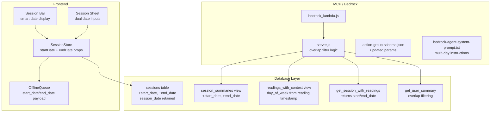
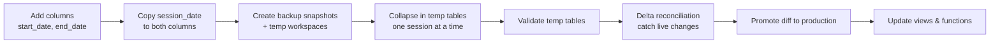

# Design Document: Multi-Day Sessions

## Overview

This feature replaces the single `session_date` column with a `start_date`/`end_date` pair, enabling sessions that span multiple calendar days (e.g., a 3-day Renaissance Faire). The key design principle is **Reading_Timestamp as source of truth** — per-day analytics use the reading's own timestamp, not the session's date range.

The change touches four layers:
1. **Database** — new columns, updated views/functions, data migration + collapse
2. **Frontend** — SessionStore properties, session sheet inputs, session bar display
3. **MCP Server** — date-range overlap filtering in tool queries
4. **Bedrock Agent** — updated schema and system prompt

The `session_date` column is retained (not dropped) for backwards compatibility during rollout.

## Architecture



### Migration Sequence



### Safe Migration Strategy

The collapse migration uses a **sandbox approach** to protect production data:

1. **Backup snapshots** — `sessions_backup` and `readings_backup` are frozen copies of production at snapshot time. Retained indefinitely for burn-in verification (NOT deleted by this project).
2. **Temp workspaces** — `sessions_temp` and `readings_temp` are full copies where all merge operations happen. No FK constraints on temp tables.
3. **Collapse in temp** — iterate sessions one at a time, determine real end_date from reading timestamps, identify merge groups, reassign reading session_ids, delete merged sessions. All in temp.
4. **Validate** — confirm counts, no orphans, timestamps preserved, end_dates correct.
5. **Delta reconciliation** — any readings/sessions added to production after the snapshot timestamp get incorporated before promotion.
6. **Promote as diff** — apply only the changes back to production: (a) update reading session_ids that changed, (b) update session start/end dates, (c) delete merged-away sessions. Children first, parents after (FK-safe order).

## Components and Interfaces

### Timestamp Storage Strategy

**Design principle:** "What time did the clock say?" is the source of truth.

Reading timestamps are stored as `timestamp without time zone` — the literal local clock time when the reading was created. No UTC conversion on write, no timezone conversion on read. 9:38pm is 9:38pm everywhere.

A `tz_offset` integer column (whole hours, e.g., -7) is stored for reference but is NOT used in display math. It exists only for provenance/auditability.

**Write path (new readings):**
```javascript
// BEFORE: UTC
timestamp: new Date().toISOString()  // "2026-07-05T03:38:00.000Z"

// AFTER: Local clock time
const now = new Date();
const localISO = now.getFullYear() + '-' + 
    String(now.getMonth()+1).padStart(2,'0') + '-' +
    String(now.getDate()).padStart(2,'0') + 'T' +
    String(now.getHours()).padStart(2,'0') + ':' +
    String(now.getMinutes()).padStart(2,'0') + ':' +
    String(now.getSeconds()).padStart(2,'0') + '.' +
    String(now.getMilliseconds()).padStart(3,'0');
const tzOffset = -(now.getTimezoneOffset() / 60);  // -7 for PDT
// sends: { timestamp: "2026-07-04T21:38:00.000", tz_offset: -7 }
```

**Read path:** No conversion. The stored value IS the display value. Views derive date/time fields directly:
```sql
r.timestamp::date AS reading_date,
EXTRACT(dow FROM r.timestamp::date) AS day_of_week_num,
EXTRACT(hour FROM r.timestamp) AS hour_local
```

**Backfill strategy:** Existing UTC timestamps are converted to local time using a location→timezone mapping. Each distinct session location gets a timezone offset (determined by location name, confirmed by user). The conversion: `timestamp + (offset * interval '1 hour')`.

### Database Schema Changes

**New columns on `blacksheep_reading_tracker_sessions`:**

| Column | Type | Constraint |
|--------|------|-----------|
| `start_date` | date | NOT NULL (after migration) |
| `end_date` | date | NOT NULL (after migration) |

**CHECK constraint:** `end_date >= start_date`

The columns are added as nullable first, populated by migration, then altered to NOT NULL.

### SessionStore Interface Changes

```javascript
// BEFORE
get sessionDate()     → this._sessionDate
set sessionDate(val)  → this._sessionDate = val

get canCreateSession  → this.userId && this._location.trim() && this._sessionDate && this._price
get hasValidSession   → this._sessionId && this.userId && this._location.trim() && this._sessionDate

// AFTER
get startDate()       → this._startDate
set startDate(val)    → this._startDate = val

get endDate()         → this._endDate
set endDate(val)      → this._endDate = val

get canCreateSession  → this.userId && this._location.trim() && this._startDate && this._endDate && this._price
get hasValidSession   → this._sessionId && this.userId && this._location.trim() && this._startDate
```

### Session Bar Display Logic

```javascript
formatSessionDate(startDate, endDate) {
    if (startDate === endDate) {
        // Single day: "06/20"
        return MM/DD format
    }
    const start = parseDate(startDate);
    const end = parseDate(endDate);
    
    if (start.year !== end.year) {
        // Cross-year: "Dec 31, 2025–Jan 1, 2026"
        return `${mon} ${dd}, ${yyyy}–${mon} ${dd}, ${yyyy}`;
    }
    if (start.month === end.month) {
        // Same month: "Jun 20–22"
        return `${mon} ${dd}–${dd}`;
    }
    // Different months: "Jun 30–Jul 2"
    return `${mon} ${dd}–${mon} ${dd}`;
}
```

### MCP Server Query Changes

**Dynamic `search_by` param** (replaces individual filter params — solves Bedrock's 5-param limit):

Bedrock action groups support max 5 params per tool. Instead of adding new params for each filterable field, both `list_sessions_v2` and `list_readings_v2` are refactored to accept a single `search_by` JSON param containing field:value pairs. The Lambda parses the JSON and dynamically builds a Supabase query using an allowlist/filterMap.

**Action group schema (Bedrock):**
```json
{
  "user_id": "string (User UUID)",
  "search_by": "string (JSON object with field:value pairs)",
  "limit": "number (max results)"
}
```

**MCP schema (IDE):** Keeps individual params for developer convenience, but internally maps them to the same filterMap. Backward compatible.

**FilterMap for `list_sessions_v2`:**
```javascript
const sessionFilterMap = {
  location: (q, v) => q.ilike('location', `%${v}%`),
  format: (q, v) => q.ilike('format', `%${v.trim()}%`),
  start_date: (q, v) => q.gte('end_date', v),       // overlap: session ends on or after filter start
  end_date: (q, v) => q.lte('start_date', v),        // overlap: session starts on or before filter end
  day_of_week: (q, v) => /* subquery: sessions with readings on this day */,
  session_duration_days: (q, v) => q.eq('session_duration_days', v),
  // future: label, etc.
};
```

**FilterMap for `list_readings_v2`:**
```javascript
const readingFilterMap = {
  location: (q, v) => q.ilike('location', `%${v}%`),
  payment: (q, v) => q.eq('payment', v),
  source: (q, v) => q.eq('source', v),
  start_date: (q, v) => q.gte('reading_date', v),
  end_date: (q, v) => q.lte('reading_date', v),
  min_tip: (q, v) => q.gte('tip', v),
  max_tip: (q, v) => q.lte('tip', v),
  time_of_day: (q, v) => q.eq('time_of_day', v),
  day_of_week: (q, v) => q.eq('day_of_week_num', dayMap[v.toLowerCase()]),
  session_duration_days: (q, v) => q.eq('session_duration_days', v),
  // future: label, etc.
};
```

**Key principles:**
- All filtering is DB-side via Supabase query builder — Lambda never downloads and filters locally
- SQL construction is parameterized via Supabase client (no injection risk)
- Unknown fields in search_by are silently ignored (no error)
- Backward compatible: old-style individual params still work by mapping into the filterMap internally

**Date range overlap logic** (replaces simple `gte`/`lte` on `session_date`):

```javascript
// BEFORE (exact date match)
if (start_date) query = query.gte('session_date', start_date);
if (end_date)   query = query.lte('session_date', end_date);

// AFTER (range overlap)
if (start_date) query = query.gte('end_date', start_date);   // session ends on or after filter start
if (end_date)   query = query.lte('start_date', end_date);   // session starts on or before filter end
```

This implements the overlap condition: `session.start_date <= filter.end_date AND session.end_date >= filter.start_date`.

### Day-of-Week Filter Change

The `day_of_week` filter in `list_sessions_v2` currently uses `session_date` via the view's `day_of_week_num`. For multi-day sessions, this needs to check if the session contains any reading on that day. This moves from a view-column filter to a subquery or a join against `readings_with_context`.

**Approach:** The `session_summaries` view retains `day_of_week_num` derived from `start_date` for single-day sessions. For the `day_of_week` filter in `listSessionsV2`, we switch to a subquery approach:

```javascript
if (day_of_week) {
    // Filter sessions that have at least one reading on this day
    const dayNum = dayMap[day_of_week.toLowerCase()];
    query = query.filter('id', 'in', 
        supabase.from('readings_with_context')
            .select('session_id')
            .eq('day_of_week_num', dayNum)
    );
}
```

**Note:** If Supabase JS client doesn't support subquery filters cleanly, the alternative is an RPC function or filtering the `day_of_week` in the view based on reading timestamps.

### Offline Queue Payload Update

The `update_session` operation's payload changes from:
```javascript
{ session_date: '2025-06-20', location: '...', reading_price: 40 }
```
to:
```javascript
{ start_date: '2025-06-20', end_date: '2025-06-22', location: '...', reading_price: 40 }
```

No structural change to OfflineQueue itself — only the payload content differs. The `_executeMessage` method already passes `message.payload` directly to the Supabase `update()`.

## Data Models

### Sessions Table (Post-Migration)

```sql
blacksheep_reading_tracker_sessions
├── id              uuid PK (gen_random_uuid())
├── session_date    date            -- RETAINED for backwards compat, defaults CURRENT_DATE
├── start_date     date NOT NULL   -- NEW
├── end_date       date NOT NULL   -- NEW
├── location        text
├── reading_price   numeric
├── readings        jsonb           -- legacy, no longer written
├── user_name       text NOT NULL
├── user_id         uuid
├── type            text NOT NULL DEFAULT 'event'
├── format          text
├── created_at      timestamptz
└── updated_at      timestamptz

CHECK (end_date >= start_date)
```

### Session In-Memory State (Post-Change)

```javascript
{
    sessionId: "uuid",
    location: "Denver Fall 25",
    startDate: "2025-06-20",   // was sessionDate
    endDate: "2025-06-22",     // NEW
    price: 40,
    type: "event",
    format: "Expo",
    readings: [],
    _loading: false
}
```

### Collapse Migration — Merge Group Identification

A "merge group" is defined as consecutive calendar days for the same (user_id, location, format, type) tuple. The SQL to identify groups:

```sql
WITH ordered_sessions AS (
    SELECT *,
           session_date - ROW_NUMBER() OVER (
               PARTITION BY user_id, location, format, type 
               ORDER BY session_date
           )::int AS group_key
    FROM sessions_temp
    WHERE start_date = end_date  -- only collapse single-day sessions
),
merge_groups AS (
    SELECT user_id, location, format, type, group_key,
           MIN(session_date) AS earliest_date,
           MAX(session_date) AS latest_date,
           ARRAY_AGG(id ORDER BY session_date) AS session_ids,
           COUNT(*) AS session_count
    FROM ordered_sessions
    GROUP BY user_id, location, format, type, group_key
    HAVING COUNT(*) > 1
)
SELECT * FROM merge_groups ORDER BY earliest_date;
```

The surviving session is `session_ids[0]` (earliest date). Readings from other sessions in the group are reassigned to the survivor in `readings_temp`, then empty sessions are deleted from `sessions_temp`.

### End Date Determination (Per-Session, Iterative)

For each session in `sessions_temp`, the correct end_date is determined one at a time:

```sql
-- For each session, find the latest reading date
SELECT (MAX(r.timestamp) AT TIME ZONE 'America/New_York')::date AS latest_reading_date
FROM readings_temp r
WHERE r.session_id = :session_id;

-- end_date = GREATEST(start_date, latest_reading_date)
-- If no readings exist, end_date stays as start_date
```

This handles two cases:
1. **Sessions with readings spanning multiple days** (like Amanda's current active session) — get `end_date` = latest reading's date
2. **Sessions that will be merged** — get `end_date` updated by the merge logic to the latest date in the group

### Promotion Strategy (Diff-Based)

The promote step applies changes from temp back to production as a targeted diff, NOT a bulk overwrite:

```sql
-- Step 1: Record snapshot timestamp at start of migration
-- snapshot_time = NOW() at time of temp table creation

-- Step 2: Delta reconciliation — find items added after snapshot
SELECT id FROM blacksheep_reading_tracker_readings 
WHERE created_at > :snapshot_time;

SELECT id FROM blacksheep_reading_tracker_sessions
WHERE created_at > :snapshot_time;

-- Step 3: Promote (children first, parents after)
-- 3a: Update reading session_ids that changed
UPDATE blacksheep_reading_tracker_readings r
SET session_id = t.session_id
FROM readings_temp t
WHERE r.id = t.id AND r.session_id != t.session_id;

-- 3b: Update session start/end dates
UPDATE blacksheep_reading_tracker_sessions s
SET start_date = t.start_date, end_date = t.end_date
FROM sessions_temp t
WHERE s.id = t.id;

-- 3c: Delete merged-away sessions (exist in backup, not in temp)
DELETE FROM blacksheep_reading_tracker_sessions
WHERE id IN (
    SELECT id FROM sessions_backup
    EXCEPT
    SELECT id FROM sessions_temp
);
```

### Backup Retention

Backup tables (`sessions_backup`, `readings_backup`) are NOT deleted by this project. They remain in the database for burn-in verification. Cleanup will be handled in a future project after sufficient confidence in the migration results.

### Updated Views

**session_summaries** — adds `start_date`, `end_date`, and `session_duration_days` columns alongside existing `session_date`:

```sql
SELECT s.id, s.user_id, s.user_name,
       s.session_date,        -- retained for backwards compat
       s.start_date,          -- NEW
       s.end_date,            -- NEW
       (s.end_date - s.start_date + 1) AS session_duration_days,  -- NEW
       s.location, s.reading_price, s.created_at, s.type, s.format,
       EXTRACT(dow FROM s.start_date) AS day_of_week_num,
       TRIM(to_char(s.start_date::timestamp, 'Day')) AS day_of_week_name,
       -- aggregates unchanged
       count(r.id) AS readings_count,
       ...
FROM blacksheep_reading_tracker_sessions s
LEFT JOIN blacksheep_reading_tracker_readings r ON s.id = r.session_id
GROUP BY s.id, ...;
```

**readings_with_context** — derives day_of_week from reading timestamp directly (no timezone conversion needed since timestamps are already local):

```sql
SELECT r.id, r.session_id, r.timestamp, r.tz_offset, r.tip, r.price AS reading_price,
       r.payment, r.source, r.created_at,
       s.session_date,
       s.start_date,           -- NEW
       s.end_date,             -- NEW
       s.location, s.user_name, s.user_id,
       s.type AS session_type, s.format AS session_format,
       s.reading_price AS session_default_price,
       COALESCE(r.price, s.reading_price) AS effective_price,
       COALESCE(r.price, s.reading_price) + COALESCE(r.tip, 0) AS total_earnings,
       EXTRACT(hour FROM r.timestamp) AS hour_local,
       CASE
           WHEN EXTRACT(hour FROM r.timestamp) < 12 THEN 'morning'
           WHEN EXTRACT(hour FROM r.timestamp) < 17 THEN 'afternoon'
           ELSE 'evening'
       END AS time_of_day,
       EXTRACT(dow FROM r.timestamp::date) AS day_of_week_num,
       TRIM(to_char(r.timestamp::date, 'Day')) AS day_of_week_name,
       r.timestamp::date AS reading_date,
       (s.end_date - s.start_date + 1) AS session_duration_days
FROM blacksheep_reading_tracker_readings r
JOIN blacksheep_reading_tracker_sessions s ON r.session_id = s.id;
```

### Updated Functions

**get_session_with_readings** — returns `start_date` and `end_date` in session JSON (alongside `session_date`).

**get_user_summary** — changes date filtering from exact `session_date` match to overlap:
```sql
-- BEFORE
AND (p_start_date IS NULL OR s.session_date >= p_start_date)
AND (p_end_date IS NULL OR s.session_date <= p_end_date)

-- AFTER (overlap)
AND (p_start_date IS NULL OR s.end_date >= p_start_date)
AND (p_end_date IS NULL OR s.start_date <= p_end_date)
```

## Error Handling

### Migration Errors

| Error | Handling |
|-------|----------|
| NULL session_date during column copy | Skip row, log warning, continue |
| CHECK constraint violation on insert/update | Return Postgres error 23514 with descriptive message |
| Collapse merge error in temp (reading reassignment fails) | Roll back that merge group in temp only, log failure, continue to next group |
| Validation failure in temp tables | Abort promotion, retain temp and backup for debugging |
| Delta reconciliation finds conflicting session_id | Log warning, keep production version (live data wins) |
| Promotion step fails | Abort, production unchanged, temp and backup retained for retry |

### Frontend Errors

| Error | Handling |
|-------|----------|
| End date before start date (user input) | Show validation error, prevent save |
| Supabase save fails (start_date/end_date) | Enqueue to OfflineQueue with updated payload |
| Legacy session loaded without start/end_date | Fallback: use session_date for both start and end |

### MCP/Bedrock Errors

| Error | Handling |
|-------|----------|
| Missing start_date/end_date in session data | Fall back to session_date if available |
| Invalid date range in filter params | Ignore invalid filter, return unfiltered results |

## Testing Strategy

Per project rules: **no property-based testing**. All tests are example-based Jest tests, and testing is the last implementation task.

### Unit Test Coverage Plan

**SessionStore tests:**
- `startDate`/`endDate` getters and setters
- `canCreateSession` requires both dates
- `hasValidSession` checks startDate
- `save()` sends start_date and end_date in update payload
- `createSession()` inserts with start_date/end_date
- `loadExistingSession()` maps start_date/end_date fields
- Backwards compat: loading a session with only session_date still works (fallback)

**Date display formatting:**
- Single day (startDate === endDate) → "06/20"
- Multi-day same month → "Jun 20–22"
- Multi-day different months → "Jun 30–Jul 2"
- Cross-year → "Dec 31, 2025–Jan 1, 2026"

**Session sheet validation:**
- End date before start date shows error
- Both dates default to today for new sessions
- Edit mode populates from stored values

**MCP server tests:**
- Overlap filter logic: session spanning Jun 20–22, query for Jun 21 returns it
- Single-day session behaves same as before
- Day-of-week filter uses reading timestamp
- get_user_summary overlap filtering

**Offline queue:**
- `update_session` payload includes start_date/end_date

### Integration/Manual Testing

- Create a multi-day session in the UI, verify DB has correct start/end dates
- Load an existing multi-day session, verify bar shows range format
- Run collapse migration on staging data, verify reading counts preserved
- Query Gpsy: "how was Saturday at Denver?" — verify reading-timestamp-based day filtering
- Offline session creation queued and flushed with correct payload

### Migration Validation

Post-migration SQL checks (run after each step):
1. `SELECT count(*) FROM sessions WHERE start_date IS NULL OR end_date IS NULL` → should be 0
2. `SELECT count(*) FROM sessions WHERE end_date < start_date` → should be 0
3. Compare pre/post reading counts per session
4. Verify no orphaned readings (`readings.session_id NOT IN sessions.id`)
