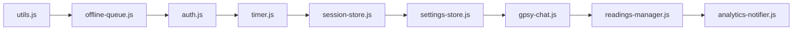

# Design Document: Offline Queue

## Overview

Replace the current snapshot-based localStorage sync with an operation-message queue. Instead of saving the full session state on every change and running a diff/reconcile cycle on reconnect, each failed Supabase mutation becomes a typed message appended to a FIFO queue in localStorage. When connectivity returns, the queue is flushed sequentially — no diffing, no reconciliation, no ambiguity about what changed.

### Design Rationale

The current approach has three fundamental problems:
1. **Snapshot reconciliation is fragile** — diffing a full local state against DB state produces incorrect results when operations overlap or conflict
2. **Order is lost** — a snapshot doesn't encode which operations happened in what sequence
3. **Debugging is opaque** — there's no way to inspect what actually needs to sync

The queue approach solves all three: operations are atomic, ordered, and inspectable.

## Architecture

### System Diagram

```mermaid
flowchart TB
    subgraph Browser
        SS[SessionStore] -->|"enqueue on failure"| OQ[OfflineQueue]
        OQ -->|"persist"| LS[(localStorage<br/>offlineQueue_{userId})]
        OQ -->|"flush"| SC[supabaseClient]
        
        OE[Online Event] -->|"trigger"| OQ
        SW_MSG[SW Message<br/>SYNC_READINGS] -->|"trigger"| OQ
        AUTH[checkAuth success] -->|"trigger"| OQ
        
        OQ -->|"on enqueue"| SB1[Snackbar: Saved offline]
        OQ -->|"on flush start"| SB2[Snackbar: Syncing...]
        OQ -->|"on flush complete"| SB3[Snackbar: All synced]
        OQ -->|"on flush error"| SB4[Snackbar: Sync failed]
        OQ -->|"on flush error"| REG[registerBackgroundSync]
    end
    
    subgraph ServiceWorker
        SYNC[sync event] -->|"postMessage"| SW_MSG
    end
    
    SC -->|"success"| DB[(Supabase PostgreSQL)]
    SC -->|"network error"| OQ
```

### Module Loading Order



`offline-queue.js` loads immediately after `utils.js` so that `window.offlineQueue` is available before SessionStore initializes.

## Components and Interfaces

### OfflineQueue Module (`modules/offline-queue.js`)

Exposed as `window.offlineQueue`. Owns all queue state and persistence.

| Method | Signature | Description |
|--------|-----------|-------------|
| `enqueue` | `enqueue(message: OperationMessage): void` | Appends message to queue, persists to localStorage, shows snackbar, registers background sync |
| `flush` | `flush(): Promise<void>` | Replays queue FIFO to Supabase, removes successful messages, stops on first error |
| `count` | `count(): number` | Returns number of pending messages |
| `peek` | `peek(): OperationMessage[]` | Returns shallow copy of queue for debugging |
| `setUserId` | `setUserId(userId: string): void` | Sets the active user and loads their queue from localStorage |

**Internal State:**
- `_queue: OperationMessage[]` — in-memory queue
- `_userId: string|null` — current user ID (determines localStorage key)
- `_flushing: boolean` — prevents concurrent flushes

**Events emitted (via callbacks or direct DOM manipulation):**
- Enqueue → snackbar "Saved offline — will sync when connected" (2s)
- Flush start → persistent snackbar "Syncing offline changes..."
- Flush success → snackbar "All changes synced" (2s), remove offline badge if online
- Flush error → snackbar "Sync failed — will retry when connected" (3s), re-register background sync

### SessionStore Changes

**Removed methods:**
- `saveToLocalStorage()`
- `debouncedSaveToLocalStorage()`
- `loadFromStorage()`
- `promptRestoreSession()`

**Preserved methods:**
- `clearUserData()` — still removes `readingTracker_${userId}` from localStorage

**Modified methods:**
- `addReading(reading)` — on Supabase error, calls `window.offlineQueue.enqueue()` with `insert_reading` message instead of `registerBackgroundSync()`
- `removeReading(index)` — on Supabase error, calls `window.offlineQueue.enqueue()` with `delete_reading` message
- `updateReading(index, field, value)` — on Supabase error, calls `window.offlineQueue.enqueue()` with `update_reading` message
- `save()` — on Supabase error, calls `window.offlineQueue.enqueue()` with `update_session` message; no longer calls `saveToLocalStorage()`

### index.html Changes

**Removed:**
- `handleBackgroundSync()` function
- `handleBackgroundBackup()` function
- `visibilitychange` event listener for backups

**Modified:**
- Service worker message handler: `SYNC_READINGS` → calls `window.offlineQueue.flush()` instead of `handleBackgroundSync()`
- `BACKUP_READINGS` handler removed
- `updateOnlineStatus()` — on online: calls `window.offlineQueue.flush()` instead of `handleBackgroundSync()`; on offline: shows badge (keeps existing behavior)
- Post-auth initialization: calls `window.offlineQueue.setUserId(auth.userId)` then `window.offlineQueue.flush()`

### Service Worker (No Changes)

The service worker remains unchanged. It already:
- Listens for `sync` event with tag `background-sync-readings`
- Posts `SYNC_READINGS` message to client
- The client-side handler is what changes (from `handleBackgroundSync()` to `window.offlineQueue.flush()`)

## Data Models

### Operation Message Schema

```javascript
// Base structure
{
  type: 'insert_reading' | 'update_reading' | 'delete_reading' | 'update_session',
  createdAt: '2025-06-01T14:30:00.000Z',  // ISO 8601
  // ...type-specific fields below
}

// insert_reading
{
  type: 'insert_reading',
  createdAt: '2025-06-01T14:30:00.000Z',
  sessionId: 'uuid-of-session',
  payload: {
    timestamp: '2025-06-01T14:30:00.000Z',
    tip: 5,
    price: 40,
    payment: 'Cash',
    source: 'Walk-up'
  }
}

// update_reading
{
  type: 'update_reading',
  createdAt: '2025-06-01T14:31:00.000Z',
  readingId: 'uuid-of-reading',
  payload: {
    field: 'tip',
    value: 10
  }
}

// delete_reading
{
  type: 'delete_reading',
  createdAt: '2025-06-01T14:32:00.000Z',
  readingId: 'uuid-of-reading'
}

// update_session
{
  type: 'update_session',
  createdAt: '2025-06-01T14:33:00.000Z',
  sessionId: 'uuid-of-session',
  payload: {
    location: 'TRF Weekend 3',
    reading_price: 45
  }
}
```

### localStorage Structure

```javascript
// Key format
`offlineQueue_${userId}`

// Value: JSON stringified array
[
  { type: 'insert_reading', createdAt: '...', sessionId: '...', payload: {...} },
  { type: 'update_reading', createdAt: '...', readingId: '...', payload: {...} },
  // ... up to 500 messages max
]
```

### Flush Execution Map

Each message type maps to a single Supabase call:

| Message Type | Supabase Operation |
|---|---|
| `insert_reading` | `.from('blacksheep_reading_tracker_readings').insert([{session_id, timestamp, tip, price, payment, source}]).select()` |
| `update_reading` | `.from('blacksheep_reading_tracker_readings').update({[field]: value}).eq('id', readingId)` |
| `delete_reading` | `.from('blacksheep_reading_tracker_readings').delete().eq('id', readingId)` |
| `update_session` | `.from('blacksheep_reading_tracker_sessions').update(payload).eq('id', sessionId)` |

## Error Handling

### Enqueue Errors

| Scenario | Behavior |
|----------|----------|
| localStorage quota exceeded | Log error to console, skip enqueue, queue remains unchanged |
| Queue at 500 message cap | Log warning to console, skip enqueue |
| `window.offlineQueue` unavailable | SessionStore catches and logs — operation is lost (same as current behavior when sync fails) |

### Flush Errors

| Scenario | Behavior |
|----------|----------|
| Network error on any message | Stop processing, retain failed + remaining messages, show snackbar, re-register background sync |
| Supabase 4xx/5xx error | Same as network error — stop, retain, show snackbar, re-register |
| Concurrent flush trigger | Ignore (guard with `_flushing` flag) |
| localStorage write fails after successful sync | Log error, flush still considered successful |

### Edge Cases

| Scenario | Behavior |
|----------|----------|
| User signs out with pending queue | Queue persists in localStorage keyed to their userId; loads when they sign back in |
| `insert_reading` replayed but session was deleted | Supabase FK constraint error → flush stops, message retained for manual debugging via `peek()` |
| `delete_reading` replayed but reading already deleted | Supabase returns success (delete of non-existent row is a no-op) → message removed, flush continues |
| `update_reading` replayed but reading was deleted | Supabase returns success (update with 0 rows affected) → message removed, flush continues |
| Page refresh during flush | Queue in localStorage still has unprocessed messages; next app load triggers flush again |
| Multiple tabs open | Each tab may trigger flush; the `_flushing` guard is per-instance, so the second tab's flush may encounter already-processed operations (handled gracefully by delete/update no-op behavior) |

## Correctness Properties

This project uses example-based Jest tests exclusively (no property-based testing). Key invariants verified through unit tests:

### Property 1: FIFO Ordering
Messages dequeue in the exact order they were enqueued. Verified by enqueuing multiple messages and asserting flush processes them chronologically by `createdAt`.

**Validates: Requirements 1.4, 2.7, 3.4**

### Property 2: Persistence Across Refresh
Every enqueue is immediately persisted to localStorage. Queue state survives page refresh and app restart. Verified by checking localStorage contents after each enqueue call.

**Validates: Requirements 1.2, 2.6**

### Property 3: Atomic Flush with Stop-on-Error
On flush error, only successfully processed messages are removed from the queue. The failed message and all subsequent messages remain intact for retry. Verified by simulating mid-flush failures.

**Validates: Requirements 4.1, 4.5**

### Property 4: No Concurrent Flushes
The `_flushing` guard ensures only one flush executes at a time. A second flush trigger while one is in progress is silently ignored. Verified by triggering flush twice in rapid succession.

**Validates: Requirements 3.7**

### Property 5: Idempotent Replay Safety
Replaying a delete or update for an already-deleted reading does not produce an error (Supabase treats these as no-ops). Verified by asserting flush continues past stale operations.

**Validates: Requirements 3.5, 4.1**

### Property 6: User Isolation
Queue is keyed per userId (`offlineQueue_{userId}`). One user's pending operations never leak into another user's queue. Verified by switching users and asserting independent queue states.

**Validates: Requirements 1.2**

### Property 7: Cap Enforcement
Queue never exceeds 500 messages. Enqueue at cap is a no-op with a console warning logged. Verified by filling queue to capacity and attempting one more enqueue.

**Validates: Requirements 1.11**

## Testing Strategy

### Approach

Example-based Jest tests with all Supabase calls mocked. No live database interactions. No property-based testing.

### Test Suites

**1. `__tests__/offline-queue.test.js`** — Unit tests for the OfflineQueue module

- **Enqueue behavior**: Verify messages are appended, localStorage is updated, insertion order is preserved
- **Enqueue edge cases**: Quota error handling, 500 message cap, invalid message shapes
- **Flush happy path**: All messages processed in FIFO order, localStorage cleared after success
- **Flush partial failure**: First N succeed then error → only first N removed from localStorage
- **Flush concurrency guard**: Second flush call while first is in progress returns immediately
- **Flush triggers background sync re-registration on error**
- **`count()` and `peek()`**: Return correct values, `peek()` returns a copy (not a reference)
- **`setUserId`**: Loads existing queue from localStorage, handles missing/corrupt data
- **Dev mode logging**: Verify console.log calls with `[OfflineQueue]` prefix

**2. `__tests__/session-store.test.js`** — Updated tests for SessionStore

- **Remove tests** referencing `saveToLocalStorage`, `loadFromStorage`, `debouncedSaveToLocalStorage`, `promptRestoreSession`
- **Update `addReading`**: Verify it calls `window.offlineQueue.enqueue()` with correct `insert_reading` message on Supabase error
- **Update `removeReading`**: Verify `delete_reading` enqueue on error
- **Update `updateReading`**: Verify `update_reading` enqueue on error
- **Update `save`**: Verify `update_session` enqueue on error
- **Verify `clearUserData`**: Still removes `readingTracker_${userId}`

**3. `__tests__/offline-queue-integration.test.js`** — Integration tests for flush triggers

- **Online event**: Verify `window.offlineQueue.flush()` is called
- **Service worker SYNC_READINGS message**: Verify flush is triggered
- **Post-auth flush**: Verify flush is called after `checkAuth` succeeds
- **Snackbar notifications**: Verify correct messages and durations for each state

### Mock Strategy

```javascript
// Mock supabaseClient for all queue tests
jest.mock() // global supabaseClient with chainable .from().insert().select() etc.

// Mock window.offlineQueue in session-store tests
window.offlineQueue = { enqueue: jest.fn(), flush: jest.fn(), count: jest.fn(), peek: jest.fn() };

// Mock localStorage
const localStorageMock = { getItem: jest.fn(), setItem: jest.fn(), removeItem: jest.fn() };

// Mock navigator.onLine (readonly property)
Object.defineProperty(navigator, 'onLine', { value: true, writable: true });
```
