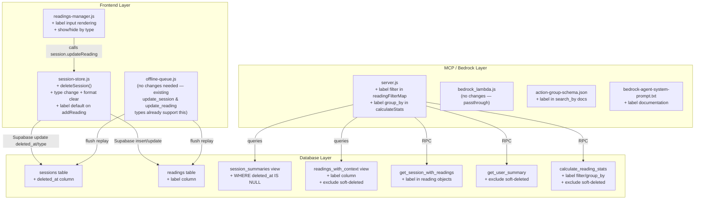
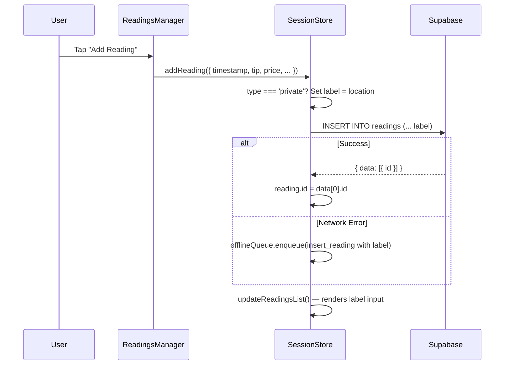
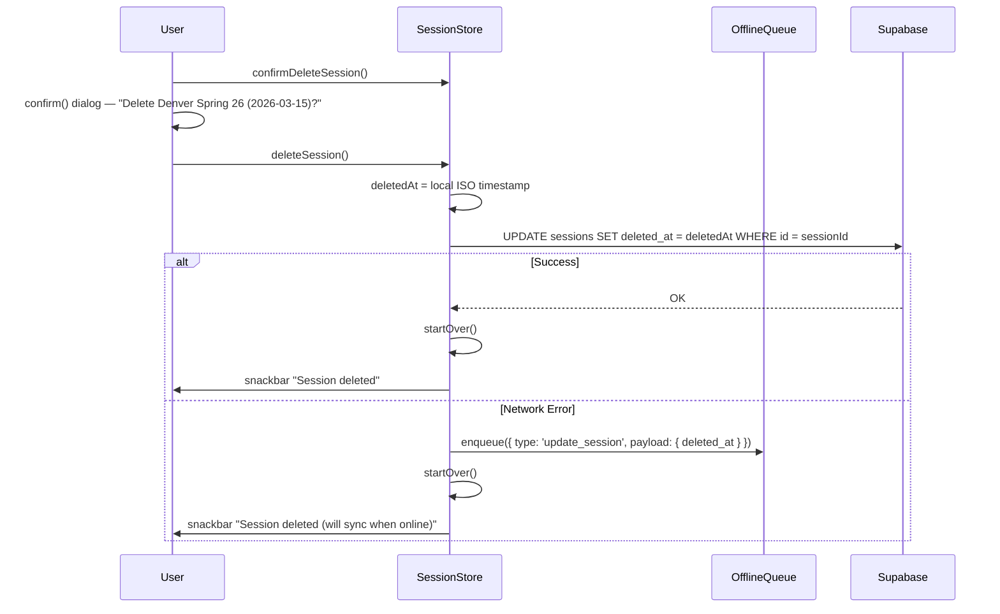
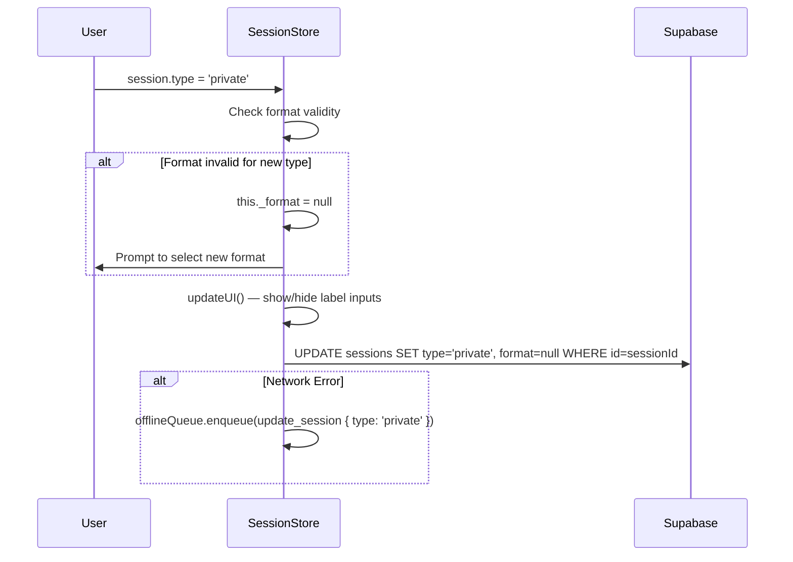

# Design: Reading Labels & Session Management

## Overview

This feature delivers three related capabilities as a single release:

1. **Reading Labels** — Optional `label` text field on readings to identify clients in private sessions
2. **Session Soft Delete** — `deleted_at` timestamp pattern to hide sessions without permanent data loss
3. **Session Type Change** — Ability to switch a session between `'event'` and `'private'` post-creation, with format validation

All three are full-stack changes spanning: Supabase database (columns, views, functions) → Frontend modules (session-store.js, readings-manager.js, offline-queue.js) → MCP server (server.js) → Bedrock Agent (system prompt, action group schema).

### Design Rationale

- **Label defaults to session location** for private sessions because Amanda's common case is a single-client session where the location IS the client name (e.g., "Sarah's House"). This eliminates extra taps for 90% of private readings.
- **Soft delete over hard delete** preserves data integrity and allows recovery. The `deleted_at` pattern is standard and integrates naturally with existing views.
- **Format validation on type change** prevents invalid state (e.g., a session marked "private" with format "Expo"). Clearing to NULL forces re-selection rather than guessing.

## Architecture



### Integration Points

| Feature | DB | Frontend | MCP Server | Bedrock |
|---------|:--:|:--------:|:----------:|:-------:|
| Reading Label | ✓ column + views + functions | ✓ label input + default logic | ✓ filter + group_by | ✓ prompt + schema |
| Soft Delete | ✓ column + views + functions | ✓ deleteSession + confirmation | (queries auto-exclude) | (transparent) |
| Type Change | (column already updatable) | ✓ type selector + format clear | (queries reflect current) | ✓ prompt note |

## Components and Interfaces

### Database Migration

#### Migration 1: Add `label` column to readings

```sql
ALTER TABLE blacksheep_reading_tracker_readings
ADD COLUMN label text DEFAULT NULL;
```

#### Migration 2: Add `deleted_at` column to sessions

```sql
ALTER TABLE blacksheep_reading_tracker_sessions
ADD COLUMN deleted_at timestamp without time zone DEFAULT NULL;
```

Note: Uses `timestamp without time zone` consistent with the project's local-clock-time convention.

#### Migration 3: Update `readings_with_context` view

```sql
CREATE OR REPLACE VIEW readings_with_context AS
SELECT
    r.id,
    r.session_id,
    r.timestamp,
    r.tz_offset,
    r.tip,
    r.price AS reading_price,
    r.payment,
    r.source,
    r.label,
    r.created_at,
    s.session_date,
    s.start_date,
    s.end_date,
    s.location,
    s.user_name,
    s.user_id,
    s.type AS session_type,
    s.format AS session_format,
    s.reading_price AS session_default_price,
    COALESCE(r.price, s.reading_price) AS effective_price,
    (COALESCE(r.price, s.reading_price) + COALESCE(r.tip, 0::numeric)) AS total_earnings,
    EXTRACT(hour FROM r.timestamp) AS hour_local,
    CASE
        WHEN EXTRACT(hour FROM r.timestamp) < 12 THEN 'morning'
        WHEN EXTRACT(hour FROM r.timestamp) < 17 THEN 'afternoon'
        ELSE 'evening'
    END AS time_of_day,
    EXTRACT(dow FROM r.timestamp::date) AS day_of_week_num,
    TRIM(to_char(r.timestamp::date::timestamp with time zone, 'Day')) AS day_of_week_name,
    r.timestamp::date AS reading_date,
    (s.end_date - s.start_date + 1) AS session_duration_days
FROM blacksheep_reading_tracker_readings r
JOIN blacksheep_reading_tracker_sessions s ON r.session_id = s.id
WHERE s.deleted_at IS NULL;
```

Changes from current:
- Added `r.label` to SELECT
- Added `WHERE s.deleted_at IS NULL` to exclude readings from soft-deleted sessions

#### Migration 4: Update `session_summaries` view

```sql
CREATE OR REPLACE VIEW session_summaries AS
SELECT
    s.id,
    s.user_id,
    s.user_name,
    s.session_date,
    s.start_date,
    s.end_date,
    (s.end_date - s.start_date + 1) AS session_duration_days,
    s.location,
    s.reading_price,
    s.created_at,
    s.type,
    s.format,
    EXTRACT(dow FROM s.start_date) AS day_of_week_num,
    TRIM(to_char(s.start_date::timestamp without time zone, 'Day')) AS day_of_week_name,
    COUNT(r.id) AS readings_count,
    SUM(COALESCE(r.price, s.reading_price)) AS base_total,
    SUM(COALESCE(r.tip, 0::numeric)) AS tips_total,
    SUM(COALESCE(r.price, s.reading_price) + COALESCE(r.tip, 0::numeric)) AS total_earnings,
    AVG(COALESCE(r.tip, 0::numeric)) AS avg_tip,
    AVG(COALESCE(r.price, s.reading_price)) AS avg_price,
    MIN(r.timestamp) AS first_reading_time,
    MAX(r.timestamp) AS last_reading_time
FROM blacksheep_reading_tracker_sessions s
LEFT JOIN blacksheep_reading_tracker_readings r ON s.id = r.session_id
WHERE s.deleted_at IS NULL
GROUP BY s.id, s.user_id, s.user_name, s.session_date, s.start_date, s.end_date,
         s.location, s.reading_price, s.created_at, s.type, s.format;
```

Change: Added `WHERE s.deleted_at IS NULL`.

#### Migration 5: Update `get_session_with_readings` function

Add `'label', r.label` to the reading JSON object in the subquery's `json_build_object` call.

#### Migration 6: Update `get_user_summary` function

Add `AND s.deleted_at IS NULL` to both WHERE clauses (main query and locations subquery).

#### Migration 7: Update `calculate_reading_stats` function

Add support for:
- `p_filters->>'label'` → `AND r.label ILIKE '%' || value || '%'`
- `p_group_by = 'label'` → `v_group_col := 'r.label'`

Note: The view change (Migration 3) already excludes soft-deleted sessions from `readings_with_context`, so `calculate_reading_stats` automatically excludes them since it queries the view.

### Frontend: session-store.js

#### New Method: `deleteSession()`

```javascript
async deleteSession() {
    if (!this._sessionId) return;
    
    const deletedAt = new Date().toISOString().replace('Z', '');  // local-ish timestamp
    
    try {
        const { error } = await supabaseClient
            .from('blacksheep_reading_tracker_sessions')
            .update({ deleted_at: deletedAt })
            .eq('id', this._sessionId);
        if (error) throw error;
        
        this.startOver();
        showSnackbar('Session deleted', 'success');
    } catch (error) {
        console.error('Failed to delete session:', error);
        window.offlineQueue.enqueue({
            type: 'update_session',
            createdAt: new Date().toISOString(),
            sessionId: this._sessionId,
            payload: { deleted_at: deletedAt }
        });
        // Still startOver locally — the delete will sync later
        this.startOver();
        showSnackbar('Session deleted (will sync when online)', 'info');
    }
}
```

#### Modified: `addReading()` — label default for private sessions

```javascript
async addReading(reading) {
    // Set label default for private sessions
    if (this._type === 'private') {
        reading.label = reading.label || this._location;
    }
    
    this._readings.push(reading);
    // ... existing logic ...
    
    // Include label in insert payload
    const insertPayload = {
        session_id: this._sessionId,
        timestamp: reading.timestamp,
        tip: reading.tip || 0,
        price: reading.price,
        payment: reading.payment,
        source: reading.source,
        tz_offset: reading.tz_offset
    };
    if (reading.label !== undefined) {
        insertPayload.label = reading.label;
    }
}
```

#### Modified: `type` setter — format validation on type change

```javascript
set type(value) {
    const oldType = this._type;
    this._type = (value === 'private') ? 'private' : 'event';
    
    // Format validation on type change
    if (oldType !== this._type && this._format) {
        const eventFormats = ['Expo', 'Shop', 'Party'];
        const privateFormats = ['In-Person', 'Phone'];
        const validFormats = this._type === 'event' ? eventFormats : privateFormats;
        
        if (!validFormats.includes(this._format)) {
            this._format = null;  // Clear invalid format
        }
    }
    
    this.updateUI();
    this.save();
    
    // Persist type change to DB
    if (this._sessionId && oldType !== this._type) {
        this._persistTypeChange();
    }
}

async _persistTypeChange() {
    try {
        const updateData = { type: this._type };
        if (this._format === null) {
            updateData.format = null;  // Also clear format in DB
        }
        const { error } = await supabaseClient
            .from('blacksheep_reading_tracker_sessions')
            .update(updateData)
            .eq('id', this._sessionId);
        if (error) throw error;
    } catch (error) {
        console.error('Failed to update session type:', error);
        window.offlineQueue.enqueue({
            type: 'update_session',
            createdAt: new Date().toISOString(),
            sessionId: this._sessionId,
            payload: { type: this._type }
        });
    }
}
```

#### Modified: `showLoadSession()` — already queries `session_summaries` which now excludes soft-deleted

No code change needed — the view handles exclusion.

#### Modified: `updateReadingsList()` — label input for private sessions

Add a label input field to each reading item's HTML when session type is private.

### Frontend: readings-manager.js

#### Modified: `addReading()` — no change needed

The label default is handled in `session-store.js`'s `addReading()` method.

#### Label Input Rendering

The label input is rendered in `updateReadingsList()` within `session-store.js` (where all reading HTML is generated). The field is conditionally shown based on `this._type === 'private'`.

```html
<!-- Added inside reading-item div, after reading-right -->
${this._type === 'private' ? `
<div class="reading-field reading-label-field">
    <span class="field-label">Client:</span>
    <input type="text" class="label-input"
           value="${Utils.sanitize(reading.label || '')}"
           placeholder="${Utils.sanitize(this._location)}"
           onchange="session.updateReading(${index}, 'label', this.value)"
           onkeydown="if(event.key==='Enter') this.blur()">
</div>` : ''}
```

### Frontend: Delete Session UI

#### Confirmation Dialog

```javascript
confirmDeleteSession() {
    const location = this._location || 'Unknown';
    const date = this._startDate || 'Unknown date';
    
    if (confirm(`Delete session "${location}" (${date})? This cannot be undone from the app.`)) {
        vibrate([100, 50, 100]);
        this.deleteSession();
    }
}
```

#### Access Points

1. **Session edit sheet** — Delete button at bottom of edit form
2. **Hamburger menu** — "Delete Session" option (only visible when session is active)

### Frontend: Type Change UI

#### Session Edit Sheet — Type Selector

```html
<div class="session-edit-field">
    <label>Type:</label>
    <div class="type-toggle">
        <button class="type-btn ${session.type === 'event' ? 'active' : ''}"
                onclick="session.type = 'event'">Event</button>
        <button class="type-btn ${session.type === 'private' ? 'active' : ''}"
                onclick="session.type = 'private'">Private</button>
    </div>
</div>
```

When type changes and format is cleared, the format selector resets and prompts selection.

### MCP Server: server.js

#### Updated `readingFilterMap`

```javascript
const readingFilterMap = {
    // ... existing filters ...
    label: (q, v) => q.ilike('label', `%${v}%`),
};
```

#### Updated `calculateStats` — label support

In `calculate_reading_stats` function (Postgres), add:
- Filter: `IF p_filters->>'label' IS NOT NULL THEN v_where := v_where || format(' AND r.label ILIKE %L', '%' || (p_filters->>'label') || '%'); END IF;`
- Group by: Add `WHEN 'label' THEN 'r.label'` to the `v_group_col` CASE expression

#### Updated tool `inputSchema` definitions

Add `label` to `search_by` descriptions for `list_readings_v2` and `calculate_stats`.
Add `'label'` to valid `group_by` values for `calculate_stats`.

### MCP Server: bedrock_lambda.js

No changes needed — it's a pure passthrough. The server.js changes propagate automatically.

### Bedrock Agent: action-group-schema.json

Update `search_by` descriptions:
- `list_readings_v2`: Add `label` to available fields list
- `calculate_stats`: Add `label` to available filter fields, add `label` to group_by valid values

### Bedrock Agent: System Prompt

Add to the `list_readings_v2` tool section:
```
<param name="label">Client name/label for the reading — only populated for private sessions. Partial match, case-insensitive.</param>
```

Add to `calculate_stats` tool section:
- In search_by: `label (partial match on client name)`
- In group_by valid values: `label`

Add a new section:
```
<label_awareness>
Private session readings have an optional `label` field containing the client name (who the reading was for).
Event session readings typically have no label. Use label filter when the user asks about a specific client:
- "How much did Sarah tip?" → calculate_stats with search_by: {"label": "sarah"}
- "Show readings for John" → list_readings_v2 with search_by: {"label": "john"}
- "Client breakdown" → calculate_stats with group_by: "label"
Session type can be changed after creation. Queries always return the current type.
</label_awareness>
```

### Offline Queue: offline-queue.js

No structural changes needed. The existing operation types already support all new operations:

| Operation | Type | Payload |
|-----------|------|---------|
| Label update | `update_reading` | `{ field: 'label', value: 'Sarah' }` |
| Soft delete | `update_session` | `{ deleted_at: '2026-07-10T14:30:00.000' }` |
| Type change | `update_session` | `{ type: 'private' }` |

The `_executeMessage` method for `update_session` already does:
```javascript
await supabaseClient
    .from('blacksheep_reading_tracker_sessions')
    .update(message.payload)
    .eq('id', message.sessionId);
```

This handles any payload shape — `deleted_at`, `type`, or both.

For `update_reading`, it does:
```javascript
await supabaseClient
    .from('blacksheep_reading_tracker_readings')
    .update({ [message.payload.field]: message.payload.value })
    .eq('id', message.readingId);
```

This already supports `field: 'label'`.

## Data Models

### Reading Record (updated)

```javascript
{
    id: 'uuid',              // DB-generated
    session_id: 'uuid',      // FK to sessions
    timestamp: 'string',     // Local clock time ISO (no Z)
    tz_offset: -5,           // Integer hours from UTC
    tip: 10.00,             // Numeric
    price: 40.00,           // Numeric (null = use session price)
    payment: 'cash',        // Text
    source: 'referral',     // Text
    label: 'Sarah'          // NEW — Text, nullable, client name
}
```

### Session Record (updated)

```javascript
{
    id: 'uuid',
    user_id: 'uuid',
    user_name: 'Amanda',
    location: 'Denver Spring 26',
    start_date: '2026-03-15',
    end_date: '2026-03-17',
    reading_price: 40,
    type: 'event',           // 'event' | 'private' — NOW CHANGEABLE
    format: 'Expo',          // Cleared to null on invalid type change
    deleted_at: null         // NEW — timestamp or null
}
```

### Format Validation Rules

```javascript
const FORMAT_RULES = {
    event: ['Expo', 'Shop', 'Party'],
    private: ['In-Person', 'Phone']
};

function isFormatValidForType(format, type) {
    if (!format) return true;  // null is always valid
    return FORMAT_RULES[type].includes(format);
}
```

## Data Flow Diagrams

### Reading Label — Add Reading (Private Session)



### Session Soft Delete



### Session Type Change



## Error Handling

| Scenario | Behavior |
|----------|----------|
| Label update fails (network) | Enqueue `update_reading` with `{ field: 'label', value }`. Reading shows updated label locally. |
| Soft delete fails (network) | Enqueue `update_session` with `{ deleted_at }`. Local state cleared via `startOver()`. Session reappears on next load until sync completes. |
| Type change fails (network) | Enqueue `update_session` with `{ type }`. Local type updated immediately. If format was cleared, also enqueue format clear. |
| Offline queue flush fails | Stops at first error, retries on next `online` event. Persistent snackbar during sync. |
| Soft-deleted session loaded from offline queue | Won't happen — `session_summaries` view excludes them, and `showLoadSession()` queries that view. |
| Race condition: type change + label update | Independent operations. Label is valid regardless of type (just hidden in UI for events). DB stores it either way. |

### Edge Cases

- **Label on event readings**: DB accepts it (nullable text), but UI hides the field. If a session switches from private→event, existing labels are preserved in DB, just not displayed.
- **Soft-delete while offline**: Local `startOver()` clears state. If user creates a new session with same location/date, duplicate check fires on next creation attempt. The soft-deleted session won't conflict because it's excluded from the duplicate check query (which uses `session_summaries`).
- **Type change cascade**: Only format is cleared. Labels, readings, prices, sources — all preserved.

## Testing Strategy

Per project rules: **No PBT**. Example-based unit tests with Jest, mocking all Supabase calls.

### Test Categories

1. **session-store.js tests**
   - `deleteSession()`: Verify Supabase update called with `deleted_at`, `startOver()` called on success
   - `deleteSession()` offline: Verify `offlineQueue.enqueue` called with correct payload
   - `addReading()` private session: Verify label defaults to location
   - `addReading()` event session: Verify no label set
   - Type change format validation: Event→Private clears "Expo", keeps "In-Person"
   - Type change format validation: Private→Event clears "Phone", keeps "Shop"
   - `_persistTypeChange()`: Verify Supabase update + offline fallback

2. **readings-manager.js tests**
   - Label input rendered for private sessions
   - Label input hidden for event sessions
   - Label input `onchange` calls `updateReading(index, 'label', value)`

3. **offline-queue.js tests**
   - `update_session` with `deleted_at` payload flushes correctly
   - `update_session` with `type` payload flushes correctly
   - `update_reading` with `label` field flushes correctly

4. **MCP server tests**
   - `list_readings_v2` with `label` filter applies ILIKE
   - `calculate_stats` with `label` filter
   - `calculate_stats` with `group_by: 'label'`
   - Verify soft-deleted sessions excluded (via view — transparent to server code)

5. **Integration/E2E smoke tests**
   - Create private session → add reading → verify label in DB
   - Soft-delete session → verify excluded from session_summaries
   - Change type event→private → verify format cleared

### Testing is a single consolidated task at the end of implementation.
