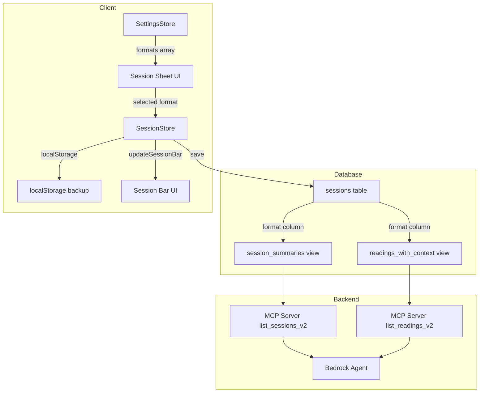

# Design Document: Session Format Field

## Overview

This feature adds a `format` dimension to sessions, capturing *what kind* of event or reading a session represents. The word "format" is internal (code/DB); users see "kind". This is distinct from `type` (event vs private), `source` (how client found you), and `location` (where).

Examples:
- Event formats: Expo, Fair, Festival, Shop, Party, Market
- Private formats: Phone, In-Person, Video

Format values are stored exactly as displayed — proper-cased, no normalization. What the user sees in the UI is what gets saved to the database.

The change touches every layer: database schema, client-side stores, UI, MCP server, and Bedrock agent.

### Key Design Decisions

1. **Nullable text column** — no enum constraint, allowing user-defined formats without migrations
2. **Backfill via SQL migration** — one-time data migration moves "Phone"/"In-Person" from source to format for historical sessions; all event sessions also backfilled (season→Expo, parties→Party, rest→Shop)
3. **Proper-cased values** — format values are stored exactly as displayed in the UI (e.g., "Expo", "In-Person", "Shop"). No lowercase normalization, no display-name-to-data-label mapping.
4. **Scope-based filtering** — formats have a `scope` property (`event`, `private`, `all`) matching the existing sources pattern
5. **Case-insensitive MCP filter** — aligns with existing location/source filter behavior (queries match regardless of case, but stored values remain proper-cased)
6. **Settings-first UI pattern** — reuses the existing bottom-sheet + name/scope/delete pattern from sources

## Architecture



### Data Flow

1. User configures available formats in Settings (SettingsStore → localStorage)
2. User selects format when creating/editing a session (Session Sheet → SessionStore)
3. SessionStore persists format to Supabase and localStorage
4. Session Bar displays active format
5. MCP Server exposes format in responses and accepts format filter
6. Bedrock Agent queries sessions by format via natural language

## Components and Interfaces

### 1. Database Migration

**File**: Applied via Supabase MCP Server (not a code file)

```sql
-- Step 1: Add column
ALTER TABLE blacksheep_reading_tracker_sessions
ADD COLUMN format text;

-- Step 2: Recreate session_summaries view (add format)
-- Step 3: Recreate readings_with_context view (add format)
-- Step 4: Backfill from readings source data (proper-cased values: Expo, Shop, Party, In-Person, Phone)
```

### 2. SettingsStore (settings-store.js)

**New defaults entry:**
```javascript
formats: [
    { name: 'Expo', scope: 'event' },
    { name: 'Fair', scope: 'event' },
    { name: 'Festival', scope: 'event' },
    { name: 'Shop', scope: 'event' },
    { name: 'Party', scope: 'event' },
    { name: 'Market', scope: 'event' },
    { name: 'Phone', scope: 'private' },
    { name: 'In-Person', scope: 'private' },
    { name: 'Video', scope: 'private' }
]
```

**New methods:**
- `migrateSourcesFormats(settings)` — removes "Phone"/"In-Person" from sources, adds to formats if not present, sets `legacySourcesMigrated` flag
- `showFormatsSheet()` — renders bottom sheet with name input + scope dropdown + delete per entry
- `updateFormat(index, field, value)` — update name/scope, persist, validate duplicates
- `deleteFormat(index)` — remove entry, persist, re-render
- `addFormat()` — append `{ name: 'New Format', scope: 'all' }`
- `closeFormatsSheet()`

**Source cleanup:**
- Remove `{ name: 'Phone', scope: 'private' }` and `{ name: 'In-Person', scope: 'private' }` from `defaults.sources`
- `loadSettings()` calls `migrateSourcesFormats()` after `migrateSources()`

### 3. SessionStore (session-store.js)

**New state:**
```javascript
this._format = null;  // in constructor
```

**New getter/setter:**
```javascript
get format() { return this._format; }
set format(value) {
    this._format = value || null;
    this.updateUI();
    this.debouncedSave();
}
```

**Modified methods:**
- `saveToLocalStorage()` — add `format: this._format` to state object
- `loadFromStorage()` — read `state.format` (default null)
- `openSessionSheet()` — render format selector buttons filtered by type scope
- `saveSessionSheet()` — include `format` in Supabase insert/update payload
- `endSession()` — reset `this._format = null`
- `updateSessionBar()` — display format tag between location and price
- `loadExistingSession()` — read format from DB row

### 4. Session Sheet UI (in session-store.js openSessionSheet)

**Format selector HTML (injected for both event and private):**
```html
<div class="input-group" id="formatSelectorGroup">
    <label>Kind of event</label>  <!-- or "Kind of reading" for private -->
    <div class="format-toggles" id="sessionSheetFormatToggles">
        <button class="format-toggle-btn active" onclick="session.selectSessionFormat('Expo')">Expo</button>
        <button class="format-toggle-btn" onclick="session.selectSessionFormat('Fair')">Fair</button>
        ...
    </div>
</div>
```

**New method:**
```javascript
selectSessionFormat(name) {
    this._sheetSelectedFormat = name;
    // toggle active class on buttons
}
```

**Validation:** `saveSessionSheet()` checks that `_sheetSelectedFormat` is set before allowing save.

### 5. Session Bar (in session-store.js updateSessionBar)

Add a `<span id="session-bar-format">` between location and price in `index.html`:
```html
<span id="session-bar-format" class="session-bar-format" style="display: none"></span>
```

In `updateSessionBar()`:
```javascript
const formatEl = document.getElementById('session-bar-format');
if (this._format) {
    const display = this._format.length > 20 
        ? Utils.sanitize(this._format.substring(0, 20)) + '…' 
        : Utils.sanitize(this._format);
    formatEl.textContent = '· ' + display;
    formatEl.style.display = '';
} else {
    formatEl.style.display = 'none';
}
```

### 6. MCP Server (server.js)

**list_sessions_v2:**
- Add `format` to inputSchema properties: `{ type: 'string', description: 'Format/kind filter (case-insensitive match)' }`
- Add filter logic: `if (format && format.trim()) query = query.ilike('format', format.trim());`
- The `session_summaries` view already returns all columns — adding `format` to the view means it appears automatically

**list_readings_v2:**
- The `readings_with_context` view will include `format` from the join — no code change needed beyond the view update

**get_session_details_v2:**
- Uses `get_session_with_readings` RPC which returns session columns — format included automatically after migration

### 7. Bedrock Agent

**action-group-schema.json:**
- Add `format` parameter to `list_sessions_v2`: `{ "type": "string", "description": "Filter by kind of event or reading (e.g. expo, fair, phone, in-person). Case-insensitive match.", "required": false }`

**bedrock-agent-system-prompt.txt:**
- Add `format` documentation to `list_sessions_v2` tool params
- Add format awareness section explaining the field's purpose and example values
- Update returns section to mention format field in responses

## Data Models

### Database Column

| Column | Type | Nullable | Default | Index |
|--------|------|----------|---------|-------|
| format | text | YES | NULL | No (low cardinality, not worth indexing until data grows) |

### localStorage Session State (after change)

```javascript
{
    sessionId: string | null,
    location: string,
    sessionDate: string,  // YYYY-MM-DD
    price: number,
    type: 'event' | 'private',
    format: string | null,  // NEW
    readings: Array
}
```

### SettingsStore formats Array

```javascript
[
    { name: string, scope: 'event' | 'private' | 'all' }
]
```

### session_summaries View (updated)

Adds `format` column from the sessions table to the existing view output.

### readings_with_context View (updated)

Adds `format` from the joined sessions table to the existing view output (aliased as `session_format` or just `format`).


## Correctness Properties

*A property is a characteristic or behavior that should hold true across all valid executions of a system — essentially, a formal statement about what the system should do. Properties serve as the bridge between human-readable specifications and machine-verifiable correctness guarantees.*

### Property 1: Format Name Length Validation

*For any* string value provided as a format name, after trimming, the SettingsStore SHALL accept it if and only if its length is between 1 and 30 characters (inclusive). Strings that are empty or exceed 30 characters after trimming SHALL be rejected or auto-removed.

**Validates: Requirements 3.1, 3.8**

### Property 2: Add Format Appends Correctly

*For any* existing formats array of length N, calling `addFormat()` SHALL result in an array of length N+1 where the last element has `name === 'New Format'` and `scope === 'all'`, and all previous elements remain unchanged.

**Validates: Requirements 3.5, 10.3**

### Property 3: Edit Format Trims Name

*For any* string value (including strings with leading/trailing whitespace), updating a format's name SHALL store the trimmed version. That is, the persisted name equals `value.trim()`.

**Validates: Requirements 3.6**

### Property 4: Delete Format Reduces Array

*For any* formats array of length N > 0 and any valid index i (0 ≤ i < N), deleting the format at index i SHALL result in an array of length N-1 where the element at position i is no longer present and all other elements retain their relative order.

**Validates: Requirements 3.7, 10.6**

### Property 5: Duplicate Name Rejection

*For any* formats array containing a format with name F and scope S, attempting to set another format entry's name to a case-insensitive match of F with the same scope S SHALL be rejected (the operation returns an error and does not persist the change).

**Validates: Requirements 3.9**

### Property 6: Source Migration Removes Only Exact Matches

*For any* sources array, the migration SHALL remove entries whose `name` property is exactly "Phone" or exactly "In-Person" (case-sensitive), and SHALL NOT remove any entry whose name merely contains those strings as substrings (e.g., "iPhone Reading", "In-Person Deluxe"). Additionally, for any sources array that already lacks "Phone" and "In-Person" exact matches, the migration SHALL leave the sources array unchanged.

**Validates: Requirements 4.2, 4.3, 4.4, 11.1, 11.2**

### Property 7: Migration Adds Removed Sources to Formats

*For any* settings where sources contain "Phone" or "In-Person" and the formats array does not already contain an entry with that name, after migration the formats array SHALL contain `{ name: "Phone", scope: "private" }` and/or `{ name: "In-Person", scope: "private" }` respectively.

**Validates: Requirements 11.3, 11.4**

### Property 8: Migration Idempotency via Flag

*For any* settings object where `legacySourcesMigrated === true`, calling the migration function SHALL NOT modify the `sources` array or the `formats` array.

**Validates: Requirements 11.6**

### Property 9: Format Scope Filtering

*For any* formats array and session type T (either 'event' or 'private'), filtering formats for display SHALL return exactly those formats whose scope equals T or equals 'all', preserving their original array order.

**Validates: Requirements 5.3**

### Property 10: Format Required for Session Save

*For any* session sheet state where no format has been selected (null/undefined), calling `saveSessionSheet()` SHALL NOT proceed with the Supabase insert/update and SHALL display a validation error.

**Validates: Requirements 5.6**

### Property 11: Format localStorage Round-Trip

*For any* format value (string or null), after calling `saveToLocalStorage()` and then `loadFromStorage()`, the SessionStore's `_format` property SHALL equal the original format value. When the stored state lacks a `format` key entirely, `_format` SHALL default to null.

**Validates: Requirements 6.3, 6.4**

### Property 12: Format Included in Supabase Payload

*For any* format value (string or null), when creating or updating a session via `saveSessionSheet()`, the Supabase insert/update payload SHALL include a `format` key with that value.

**Validates: Requirements 6.1, 6.2**

### Property 13: Format Display and Truncation

*For any* format value: if null or empty string, the session bar format element SHALL be hidden (display: none). If non-null and non-empty with length ≤ 20, the element SHALL be visible and display the sanitized format text. If length > 20, the element SHALL display exactly the first 20 characters followed by '…'.

**Validates: Requirements 7.1, 7.2, 7.3**

### Property 14: MCP Format Filter Semantics

*For any* format filter value: if the value is non-empty after trimming, the query SHALL filter sessions to only those whose format matches case-insensitively (excluding null-format sessions). If the value is empty or whitespace-only after trimming, the query SHALL return sessions regardless of format value (equivalent to no filter).

**Validates: Requirements 8.3, 8.4**

## Error Handling

| Scenario | Handling |
|----------|----------|
| Supabase insert/update fails | Offline fallback: save to localStorage with `offline_` prefix ID, register background sync. Format is preserved in local state. |
| SettingsStore fails to load | Fall back to defaults with formats array. Session sheet defaults format to "Expo" (event) or "In-Person" (private). |
| Format value in DB doesn't match any current settings format | Session bar still displays it. Edit mode still pre-fills it. User can change it to a valid format or leave it. |
| Migration encounters error mid-batch | Partial completion is acceptable — migration uses batched updates, not a single transaction. Already-migrated rows retain their format. |
| localStorage missing format key (legacy) | Default to null. Session bar hides format. User can set format on next edit. |
| Duplicate format name submitted | Show error snackbar "Name already in use", revert the input value, do not persist. |
| Format name > 30 chars | HTML `maxlength="30"` prevents input. Server-side: truncate at 30 if somehow bypassed. |

## Testing Strategy

### Unit Tests (Jest, example-based)

| Area | Tests |
|------|-------|
| SettingsStore defaults | Verify formats array has 9 entries (6 event + 3 private), Phone/In-Person NOT in sources |
| Migration smoke | Load settings with Phone/In-Person sources → verify removal + addition to formats |
| Migration flag | Settings with `legacySourcesMigrated: true` → verify no changes |
| Session Sheet defaults | New event → format "Expo"; new private → format "In-Person" |
| Session Sheet edit mode | Load session with format → verify pre-fill |
| Session Bar rendering | Format null → hidden; format "Expo" → visible; format 25 chars → truncated |
| saveSessionSheet payloads | Verify Supabase insert/update calls include `format` key |
| MCP filter | list_sessions_v2 with format param → verify `.ilike('format', ...)` called |
| MCP empty filter | list_sessions_v2 with whitespace format → verify no filter applied |
| Bedrock schema | Verify action-group-schema.json has format parameter |

### Property-Based Tests (fast-check)

**Library**: [fast-check](https://github.com/dubzzz/fast-check) (already compatible with Jest)

**Configuration**: Minimum 100 iterations per property test.

Each property test references its design document property with a tag comment:
```javascript
// Feature: session-format-field, Property {N}: {title}
```

| Property # | Test Description | Generators |
|-----------|-----------------|------------|
| 1 | Name length validation | `fc.string()` with various lengths (0–100) |
| 2 | Add format invariant | `fc.array(formatArb)` for existing array |
| 3 | Edit trim behavior | `fc.string()` with whitespace padding |
| 4 | Delete reduces array | `fc.array(formatArb, {minLength: 1})` + `fc.nat()` for index |
| 5 | Duplicate rejection | `fc.array(formatArb)` + name/scope collision |
| 6 | Source migration exact match | `fc.array(sourceArb)` with mixed names including Phone/In-Person substrings |
| 7 | Migration adds to formats | `fc.array(formatArb)` without Phone/In-Person + sources with them |
| 8 | Migration idempotency | `fc.record({legacySourcesMigrated: fc.constant(true), sources: fc.array(sourceArb), formats: fc.array(formatArb)})` |
| 9 | Scope filtering | `fc.array(formatArb)` + `fc.constantFrom('event', 'private')` |
| 10 | Format required for save | `fc.option(fc.string(), {nil: null})` for missing format |
| 11 | localStorage round-trip | `fc.option(fc.string({minLength: 1, maxLength: 30}), {nil: null})` |
| 12 | Format in Supabase payload | `fc.option(fc.string({minLength: 1, maxLength: 30}), {nil: null})` |
| 13 | Display and truncation | `fc.option(fc.string({minLength: 0, maxLength: 50}), {nil: null})` |
| 14 | MCP filter semantics | `fc.string()` for filter + `fc.array(sessionArb)` for data |

### Custom Arbitraries

```javascript
const formatArb = fc.record({
    name: fc.string({ minLength: 1, maxLength: 30 }),
    scope: fc.constantFrom('event', 'private', 'all')
});

const sourceArb = fc.record({
    name: fc.string({ minLength: 1, maxLength: 30 }),
    scope: fc.constantFrom('event', 'private', 'all')
});

const sessionArb = fc.record({
    id: fc.uuid(),
    format: fc.option(fc.string({ minLength: 1, maxLength: 30 }), { nil: null }),
    location: fc.string({ minLength: 1, maxLength: 50 }),
    session_date: fc.date().map(d => d.toISOString().split('T')[0])
});
```

### Integration Tests (manual, not automated)

- Database migration: run against staging, verify column + views + backfill
- MCP E2E: `node mcp-server/test-e2e.mjs` extended with format filter test
- Bedrock Agent: manual test via ChatGPSY asking "show me my expo events"

### What's NOT Tested with PBT

- Database migration (one-time SQL, tested manually)
- CSS touch target sizing (visual, not computable)
- Bedrock Agent natural language understanding (depends on LLM)
- UI rendering correctness (DOM structure verified with example tests)
