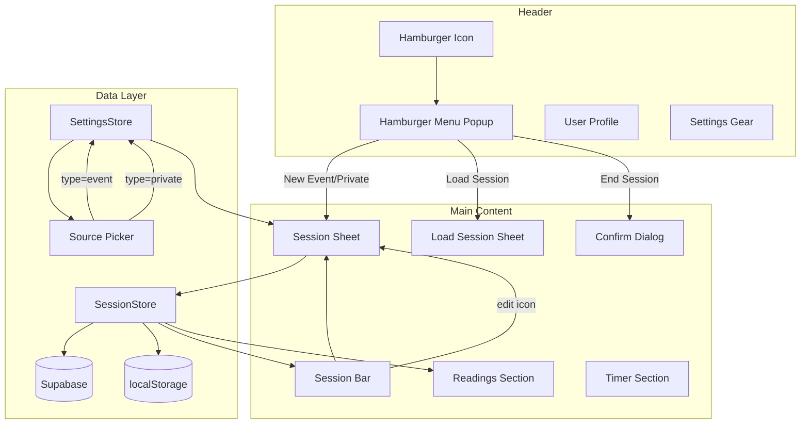
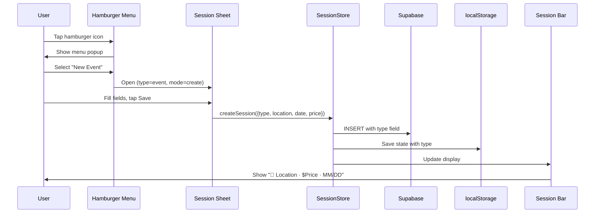

# Design Document: Session UX Redesign

## Overview

This design replaces the collapsible "Event Settings" panel with three new UI primitives — a read-only Session Bar, a Hamburger popup menu, and a Session Creation/Edit Bottom Sheet — and introduces a `type` dimension ("event" | "private") to sessions. The redesign separates session display (bar), session actions (menu), and session editing (sheet) into distinct, focused components while adding type-driven behavior throughout the source picker and settings system.

Key design goals:
- **Clarity**: Always-visible session status in a slim bar vs. a hidden-by-default collapsible panel
- **Economy of interaction**: One tap to access any session action via hamburger menu
- **Type awareness**: Event and private sessions drive different UI behavior without separate code paths where possible
- **Zero data loss**: Type field persists to both Supabase and localStorage with fallback defaults

## Architecture

### Component Diagram



### System Flow



### Modified Modules

| Module | Changes |
|--------|---------|
| `session-store.js` | Add `_type` property, remove `toggleSettings`/`collapseSettings`/`expandSettings`, add `endSession()`, update `createSession()` to accept type, update `save()`/`saveToLocalStorage()`/`loadFromStorage()` for type field |
| `settings-store.js` | Change `sources` from string[] to object[] with `{name, scope}`, add `privatePricePresets` default, add migration from legacy flat array, add scope dropdown to sources customization UI, remove `toggleSettings`/`collapseSettings` wrappers |
| `readings-manager.js` | Update `openSourceSheet()` to filter unified `sources` by scope matching session type or "all" |
| `index.html` | Remove `#event-settings` block, add session bar HTML, add hamburger icon + menu HTML, add session sheet HTML, update sources customization sheet to show scope dropdowns, add price presets settings section |

### New Components (in index.html, no new JS files)

| Component | Implementation |
|-----------|---------------|
| Session Bar | Static HTML div, updated by SessionStore.updateUI() |
| Hamburger Menu | HTML popup + overlay, methods on SessionStore |
| Session Sheet | Bottom sheet HTML (same pattern as payment/source sheets), methods on SessionStore |

## Components and Interfaces

### Session Bar

```
┌─────────────────────────────────────────────────────┐
│ 📍 Va Beach BMSE          · $65   · 10/15    ✏️   │
└─────────────────────────────────────────────────────┘
```

**DOM Structure:**
```html
<div id="session-bar" class="session-bar">
    <span id="session-bar-location" class="session-bar-location">(no active session)</span>
    <span id="session-bar-price" class="session-bar-price" style="display: none;"></span>
    <span id="session-bar-date" class="session-bar-date" style="display: none;"></span>
    <button id="btn-session-edit" class="session-bar-edit" style="display: none;">
        <i class="fas fa-pencil-alt"></i>
    </button>
</div>
```

**CSS Layout:**
```css
.session-bar {
    display: flex;
    align-items: center;
    padding: 8px 12px;
    gap: 8px;
}

.session-bar-location {
    flex: 1;              /* takes all remaining space */
    min-width: 0;         /* allows shrinking below content width */
    overflow: hidden;
    text-overflow: ellipsis;
    white-space: nowrap;
}

.session-bar-price,
.session-bar-date {
    flex-shrink: 0;       /* never shrinks */
    white-space: nowrap;
}

.session-bar-edit {
    flex-shrink: 0;
    width: 32px;
}

.session-bar-location.no-session {
    opacity: 0.5;
}
```

**Rendering Logic (in SessionStore.updateSessionBar()):**
- No session: location shows `"(no active session)"` with class `no-session`, price/date/edit hidden
- Event: location shows `"📍 ${location}"`, price shows `"· $${price}"`, date shows `"· ${MM/DD}"`
- Private: location shows `"👤 ${location}"`, price shows `"· $${price}"`, date shows `"· ${MM/DD}"`

**Truncation:** Handled entirely by CSS `text-overflow: ellipsis` on the location element — no JS character limit. The browser renders as many characters as fit in the available flex space, then applies ellipsis. Price, date, and edit icon have fixed widths and never compress.

### Hamburger Menu

**DOM Structure:**
```html
<button id="btn-hamburger" class="hamburger-btn" onclick="session.toggleHamburgerMenu()">
    <i class="fas fa-bars"></i>
</button>

<div id="hamburger-overlay" class="hamburger-overlay" onclick="session.closeHamburgerMenu()"></div>
<div id="hamburger-menu" class="hamburger-menu">
    <div class="hamburger-item" onclick="session.newEvent()">
        <i class="fas fa-calendar-alt"></i> New Event
    </div>
    <div class="hamburger-item" onclick="session.newPrivateReading()">
        <i class="fas fa-user"></i> New Private Reading
    </div>
    <div class="hamburger-item" onclick="session.showLoadSession()">
        <i class="fas fa-folder-open"></i> Load Session
    </div>
    <div id="hamburger-end-session" class="hamburger-item" onclick="session.endSession()">
        <i class="fas fa-stop-circle"></i> End Session
    </div>
</div>
```

**Behavior:**
- Opens as a positioned popup below the hamburger icon (not a full-screen drawer)
- Overlay behind captures outside taps to dismiss
- "End Session" item gets class `disabled` when `!session.hasValidSession`

### Session Sheet (Create/Edit Bottom Sheet)

**DOM Structure:**
```html
<div id="sessionSheetOverlay" class="payment-overlay" onclick="session.closeSessionCreationSheet()"></div>
<div id="sessionCreationSheet" class="session-creation-sheet sheet">
    <div class="sheet-header">
        <h3 id="sessionSheetTitle">New Event</h3>
        <button class="modal-close" onclick="session.closeSessionCreationSheet()">
            <i class="fas fa-times"></i>
        </button>
    </div>
    <div class="session-creation-content">
        <!-- Fields rendered dynamically based on type -->
        <div id="sessionSheetFields"></div>
        <button id="btn-session-save" class="btn btn-primary btn-large" onclick="session.saveSessionSheet()">
            Save
        </button>
    </div>
</div>
```

**Field rendering by type:**

| Mode | Fields |
|------|--------|
| Event (new) | Location (text), Date (today), Price (number, default from last session) |
| Event (edit) | Location (pre-filled), Date (pre-filled), Price (pre-filled) |
| Private (new) | Client Name (text), Date (today), Price (preset toggles), Source (toggle buttons) |
| Private (edit) | Client Name (pre-filled), Date (pre-filled), Price (pre-filled toggle), Source (pre-filled) |

**Price preset toggles (private):**
```html
<div class="price-presets">
    <button class="preset-btn" onclick="session.selectPresetPrice(60)">$60</button>
    <button class="preset-btn" onclick="session.selectPresetPrice(120)">$120</button>
    <button class="preset-btn" onclick="session.selectPresetPrice(150)">$150</button>
</div>
```

If `privatePricePresets` is empty, falls back to a free-form number input.

### SessionStore Interface Changes

```javascript
class SessionStore {
    // New property
    _type = 'event';  // 'event' | 'private'

    // New getter/setter
    get type() { return this._type; }
    set type(value) {
        this._type = (value === 'private') ? 'private' : 'event';
        this.updateUI();
        this.save();
    }

    // New methods
    toggleHamburgerMenu() { /* show/hide popup */ }
    closeHamburgerMenu() { /* hide popup */ }
    newEvent() { /* close menu, open sheet type=event */ }
    newPrivateReading() { /* close menu, open sheet type=private */ }
    endSession() { /* confirm dialog, clear state */ }
    openSessionSheet(mode, type) { /* mode: 'create'|'edit', type: 'event'|'private' */ }
    closeSessionCreationSheet() { /* hide sheet */ }
    saveSessionSheet() { /* validate, create/update, dismiss */ }
    updateSessionBar() { /* re-render bar text */ }

    // Removed methods
    // toggleSettings() - REMOVED
    // collapseSettings() - REMOVED
    // expandSettings() - REMOVED

    // Modified methods
    createSession(type) { /* now accepts type parameter */ }
    save() { /* now includes type in update payload */ }
    saveToLocalStorage() { /* now includes type in serialized state */ }
    loadFromStorage() { /* now reads type from stored state */ }
    loadExistingSession(data) { /* now reads type from DB record */ }
    updateUI() { /* now calls updateSessionBar(), no longer touches #event-settings */ }
}
```

### SettingsStore Interface Changes

```javascript
class SettingsStore {
    defaults = {
        // ... existing defaults ...
        sources: [
            { name: 'Referral', scope: 'event' },
            { name: 'Renu', scope: 'event' },
            { name: 'POG', scope: 'event' },
            { name: 'Repeat', scope: 'all' },
            { name: 'Phone', scope: 'private' },
            { name: 'In-Person', scope: 'private' }
        ],
        privatePricePresets: [60, 120, 150]
    };

    // Modified methods (sources now array of objects)
    customizeSources() { /* open unified sources sheet with scope dropdowns */ }
    showSourcesSheet() { /* render list with name input + scope dropdown per row */ }
    updateSource(index, field, value) { /* edit name or scope */ }
    deleteSource(index) { /* remove entry */ }
    addSource() { /* append { name: 'New Source', scope: 'all' } */ }

    // New methods (price presets)
    customizePrivatePricePresets() { /* open presets sheet */ }
    showPrivatePricePresetsSheet() { /* render list */ }
    closePrivatePricePresetsSheet() { /* hide sheet */ }
    updatePrivatePricePreset(index, value) { /* edit entry */ }
    deletePrivatePricePreset(index) { /* remove entry */ }
    addPrivatePricePreset() { /* append entry */ }

    // Migration: legacy flat array → scoped objects
    migrateSources(settings) {
        if (Array.isArray(settings.sources) && typeof settings.sources[0] === 'string') {
            settings.sources = settings.sources.map(name => ({ name, scope: 'event' }));
        }
    }

    // Removed methods
    // toggleSettings() - REMOVED
    // collapseSettings() - REMOVED
}
```

### ReadingsManager Interface Changes

```javascript
class ReadingsManager {
    openSourceSheet(index) {
        // Changed: filter unified sources by session type scope
        const allSources = window.settings.get('sources');
        const sessionType = window.session.type;
        const sources = allSources.filter(s => s.scope === sessionType || s.scope === 'all');

        if (sources.length === 0) {
            // Show "no sources configured" message
            return;
        }
        // ... render sources.map(s => s.name) as options ...
    }
}
```

## Data Models

### Database Schema Change

```sql
-- Migration: add_session_type_column
ALTER TABLE blacksheep_reading_tracker_sessions
    ADD COLUMN type text DEFAULT 'event';

-- Backfill existing rows
UPDATE blacksheep_reading_tracker_sessions
    SET type = 'event'
    WHERE type IS NULL;

-- Apply NOT NULL constraint after backfill
ALTER TABLE blacksheep_reading_tracker_sessions
    ALTER COLUMN type SET NOT NULL;
```

### SessionStore localStorage Schema

```javascript
// Key: readingTracker_{userId}
{
    sessionId: "uuid-string",
    location: "Va Beach BMSE",
    sessionDate: "2025-10-15",
    price: 65,
    type: "event",           // NEW FIELD
    readings: [
        { id: "uuid", timestamp: "ISO", tip: 5, price: 65, payment: "Cash", source: "Referral" }
    ]
}
```

### SettingsStore localStorage Schema

```javascript
// Key: tarotTrackerSettings
{
    // ... existing settings ...
    sources: [                                    // CHANGED from string[] to object[]
        { name: "Referral", scope: "event" },
        { name: "Renu", scope: "event" },
        { name: "POG", scope: "event" },
        { name: "Repeat", scope: "all" },
        { name: "Phone", scope: "private" },
        { name: "In-Person", scope: "private" }
    ],
    privatePricePresets: [60, 120, 150]           // NEW
}
```

**Migration:** On load, if `sources` is a flat string array (legacy format), convert each entry to `{ name: entry, scope: 'event' }` and save immediately.

### Session Insert Payload (to Supabase)

```javascript
{
    session_date: "2025-10-15",
    user_id: "uuid",
    user_name: "Amanda Madden",
    location: "Va Beach BMSE",    // or client name for private
    reading_price: 65,
    type: "event"                 // NEW FIELD - "event" or "private"
}
```

## Correctness Properties

*A property is a characteristic or behavior that should hold true across all valid executions of a system — essentially, a formal statement about what the system should do. Properties serve as the bridge between human-readable specifications and machine-verifiable correctness guarantees.*

### Property 1: Session bar display formatting

*For any* valid session state (event or private) with any location/client name string, any positive price, and any valid date, the session bar SHALL render the location in a flex item with CSS `text-overflow: ellipsis` (no JS character limit), the price prefixed with "· $", and the date formatted as "· MM/DD" in separate fixed-width flex items. The location element SHALL contain the emoji prefix "📍" for event or "👤" for private.

**Validates: Requirements 1.2, 1.3**

### Property 2: Session sheet pre-fill correctness

*For any* active session with arbitrary valid field values (location, date, price, type), opening the Session Sheet in edit mode SHALL populate every editable field with the exact current session value, and the type SHALL be locked (not editable).

**Validates: Requirements 1.5, 3.4**

### Property 3: Session type persistence round-trip

*For any* session with type "event" or "private", after creating the session (insert to DB) and saving to localStorage, then reading back from either the database record or localStorage, the type field SHALL equal the original type value.

**Validates: Requirements 5.4, 5.7, 6.1**

### Property 4: Session type restoration with invalid input fallback

*For any* string value that is not exactly "event" or "private" (including empty, null, undefined, or arbitrary text), when loaded from either a database record or localStorage, the SessionStore SHALL normalize the type to "event".

**Validates: Requirements 5.6, 6.3**

### Property 5: Type-driven source picker selection

*For any* non-empty sources array and any session type, the source picker SHALL display exactly the entries where `scope === sessionType || scope === 'all'`, in their original array order, showing only the `name` field as selectable options.

**Validates: Requirements 7.1, 7.2**

### Property 6: Session validation rejects invalid input

*For any* string composed entirely of whitespace characters (spaces, tabs, newlines) used as the Location (event) or Client Name (private) field, the Session Sheet save operation SHALL be prevented and the field SHALL receive a visual error indicator. Conversely, *for any* string containing at least one non-whitespace character, the location/name validation SHALL pass.

**Validates: Requirements 3.7, 3.8**

### Property 7: Default price derivation from session history

*For any* array of previously created sessions (possibly empty), the default price for a new session SHALL equal the `reading_price` of the most recently created session in the array, or 40 if the array is empty.

**Validates: Requirements 3.1**

### Property 8: End session clears all state

*For any* active session state (with arbitrary valid fields), confirming "End Session" SHALL result in sessionId being null, location being empty, readings being empty, and the session bar displaying the no-session text.

**Validates: Requirements 2.8, 4.5**

## Error Handling

| Scenario | Behavior |
|----------|----------|
| DB insert fails during session creation | Show snackbar error, register background sync, session remains in unsaved state |
| DB update fails during session edit | Show snackbar error, register background sync, localStorage retains updated state |
| Invalid type in DB record | Fallback to "event", log warning to console |
| Invalid type in localStorage | Fallback to "event", log warning to console |
| Empty privateSources setting when opening picker | Show "No sources configured" message, disable selection |
| Empty privatePricePresets when opening private sheet | Render free-form number input instead of preset buttons |
| Network offline during session creation | Use offline pattern: generate temp ID, queue for sync, show session as active |
| Session sheet save with missing fields | Prevent save, highlight missing fields with red border, no snackbar (visual only) |
| Concurrent session edit (edge case) | Last-write-wins — no optimistic locking needed for single-user app |

## Testing Strategy

### Property-Based Tests (fast-check)

The project uses Jest. Property tests will use `fast-check` library with minimum 100 iterations per property.

Each correctness property maps to a single property-based test:

1. **Session bar formatting** — Generate random {type, location (0-200 chars), price (0.01-9999), date} tuples, verify output matches regex pattern
2. **Session sheet pre-fill** — Generate random session objects, call pre-fill logic, assert each field matches input
3. **Type persistence round-trip** — Generate random sessions with valid type, serialize/deserialize, assert type preserved
4. **Type fallback** — Generate arbitrary strings (not "event"/"private"), load into session, assert type === "event"
5. **Source picker by type** — Generate random source arrays + type, open picker, assert rendered options match array
6. **Validation rejection** — Generate whitespace-only strings, assert rejection; generate valid strings, assert acceptance
7. **Default price** — Generate arrays of session objects with random prices, assert default equals last item's price (or 40)
8. **End session clears state** — Generate random active sessions, end, assert all fields cleared

**Tag format:** `Feature: session-ux-redesign, Property {N}: {title}`

### Unit Tests (example-based)

- Session bar renders "(no active session)" when no session
- Hamburger menu contains exactly 4 items in correct order
- "End Session" item disabled when no active session
- Tapping outside menu closes it
- Private sheet shows preset buttons from settings
- Empty presets falls back to free-form input
- Timer remains visible in both modes
- Removed methods (toggleSettings, etc.) don't exist on SessionStore

### Integration Tests (mocked DB — no real Supabase calls)

- Create event session → insert payload includes type "event"
- Create private session → insert payload includes type "private"
- Load existing session (mocked response) → type field propagates to in-memory state
- Modify privateSources → next private session picker shows updated list
- Supabase calls are mocked via jest.mock — tests verify payloads and state transitions, not actual DB behavior
