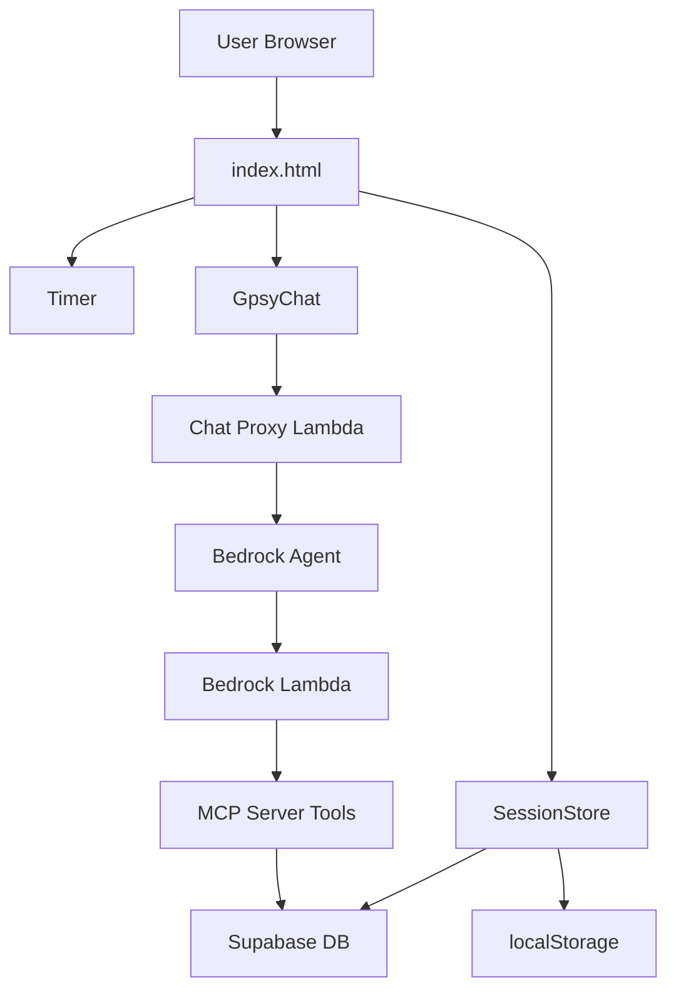
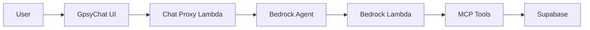

# Architecture & Technical Documentation

## System Architecture



## Modular Architecture

### File Structure
- `index.html`: Main HTML with initialization and event handlers
- `modules/session-store.js`: SessionStore class
- `modules/timer.js`: Timer class
- `modules/gpsy-chat.js`: GpsyChat class
- `modules/settings-store.js`: SettingsStore class

### Core Classes

#### SessionStore (`modules/session-store.js`)
- Manages session state and readings array
- Handles database sync with debouncing
- Computed properties: `canCreateSession`, `hasValidSession`, `sessionPhase`
- Auto-save on every state change

#### Timer (`modules/timer.js`)
- Canvas-based circular countdown (300x300px)
- Web Audio API for alarms (1000Hz square wave)
- Screen Wake Lock API + silent audio fallback
- requestAnimationFrame for smooth rendering
- Notification system with service worker integration

#### GpsyChat (`modules/gpsy-chat.js`)
- SMS-style chat interface
- HTML content rendering for tables/lists
- Animated logo avatars
- Suggestion buttons with data-prompt attributes
- User context injection for queries

#### SettingsStore (`modules/settings-store.js`)
- App preferences management
- Payment method customization
- Dark mode toggle
- Notification settings
- Settings drawer UI management

## Data Structure

### Reading Object
```javascript
{
  timestamp: "2025-01-15T14:30:00.000Z",  // ISO datetime
  tip: 10,                                 // Numeric
  price: 40,                               // Null uses session price
  payment: "cash",                         // cash|cc|venmo|paypal|cashapp|custom
  source: "referral"                       // referral|renu|pog|repeat|custom
}
```

### Session State
```javascript
{
  sessionId: "uuid",
  user: "Amanda",
  location: "Denver Fall 25",
  sessionDate: "2025-01-15",  // YYYY-MM-DD
  price: 40,
  readings: [],
  _loading: false  // Prevents saves during restoration
}
```

## Database Schema

### Supabase Table: `blacksheep_reading_tracker_sessions`
- `id` (uuid, PK)
- `session_date` (date)
- `location` (text)
- `reading_price` (numeric)
- `readings` (jsonb)
- `user_name` (text, NOT NULL)
- `created_at` (timestamptz)
- `updated_at` (timestamptz)

**Connection**:
- URL: `https://uuindvqgdblkjzvjsyrz.supabase.co`
- Anon Key: (see index.html)
- RLS: Disabled (open access)

## MCP Server (Dual Lambda Architecture)

### Lambda Functions

**MCP Lambda** (PROTECTED):
- Name: `blacksheep_tarot-tracker-mcp-server`
- Handler: `index.handler` (streaming)
- URL: https://fjmqe5vx4n6r6tklpsiyzey6ea0zuzgo.lambda-url.us-east-2.on.aws/
- Status: FROZEN - only deploy when adding tools

**Bedrock Lambda** (ACTIVE):
- Name: `blacksheep_tarot-tracker-bedrock`
- Handler: `bedrock.handler` (direct response)
- ARN: arn:aws:lambda:us-east-2:944012085152:function:blacksheep_tarot-tracker-bedrock
- Status: ACTIVE - deploy here for experiments

### Available Tools
1. **list_sessions**: Session summaries with date, location, count, earnings
2. **list_readings**: Individual reading records with full details
3. **search_locations**: Partial name search for locations
4. **aggregate_readings**: Universal aggregation with grouping/filtering/sorting

### Bedrock Agent Response Format

**SUCCESS** (no responseState):
```javascript
{
  messageVersion: "1.0",
  response: {
    actionGroup: "TarotDataTools",
    function: toolName,
    functionResponse: {
      responseBody: {
        "TEXT": { body: "JSON data" }
      }
    }
  }
}
```

**REPROMPT** (missing params):
```javascript
{
  functionResponse: {
    responseState: "REPROMPT",
    responseBody: {
      "TEXT": { body: "Need more info..." }
    }
  }
}
```

**FAILURE** (errors):
```javascript
{
  functionResponse: {
    responseState: "FAILURE",
    responseBody: {
      "TEXT": { body: "Error message" }
    }
  }
}
```

**FORBIDDEN**: `responseState: "SUCCESS"` - Bedrock rejects this

## Gpsy Chat Integration

### Architecture


### Chat Proxy Lambda
- Function: `blacksheep_tarot-tracker-bedrock-chat-proxy`
- URL: https://57h2jhw5tcjn35yzuitv4zjmfu0snuom.lambda-url.us-east-2.on.aws/
- User context injection: Prepends `[User context: ${userName}]`
- Timeout: 30 seconds

### Bedrock Agent
- Agent ID: 0LC3MUMHNN
- Alias: CYVKITJVFL (version 2, "live")
- Model: Claude 3.5 Haiku
- Region: us-east-2
- Action Group: TarotDataTools

## Deployment

### AWS Amplify
- App: `reading-tracker`
- App ID: `d2otujcpa37fuv`
- Live: https://tracker.blacksheep-gypsies.com
- Amplify: https://staging.d2otujcpa37fuv.amplifyapp.com

### DNS (Squarespace)
```
Host: tracker
Points to: dol1ob2gp2gbk.cloudfront.net
Type: CNAME
```

### SSL
- Amplify Managed Certificate
- Auto-renewal enabled
- Automatic HTTPS redirect

### Deployment Process
1. Zip project files (exclude `.amazonq/`, `.git/`)
2. Upload to Amplify Console
3. Auto-detected as static site
4. CDN distribution automatic

## Lambda Deployment

**Bedrock Only** (most common):
```bash
aws lambda update-function-code \
  --function-name blacksheep_tarot-tracker-bedrock \
  --zip-file fileb://lambda.zip \
  --region us-east-2
```

**Both Functions** (when adding tools):
```bash
# MCP Lambda
aws lambda update-function-code \
  --function-name blacksheep_tarot-tracker-mcp-server \
  --zip-file fileb://lambda.zip \
  --region us-east-2

# Bedrock Lambda
aws lambda update-function-code \
  --function-name blacksheep_tarot-tracker-bedrock \
  --zip-file fileb://lambda.zip \
  --region us-east-2
```

## Testing

### Local MCP Server
```bash
cd mcp-server
npm start  # Runs test-lambda.js
```

### Lambda Invoke
```bash
aws lambda invoke \
  --function-name blacksheep_tarot-tracker-mcp-server \
  --payload '{"method":"tools/list"}' \
  --region us-east-2 \
  temp.json
```

### HTTP REST API
```bash
curl -X POST \
  https://fjmqe5vx4n6r6tklpsiyzey6ea0zuzgo.lambda-url.us-east-2.on.aws/ \
  -H "Content-Type: application/json" \
  -d '{"jsonrpc":"2.0","id":1,"method":"tools/list"}'
```

## Critical Implementation Notes

### Timezone Handling
- Use raw YYYY-MM-DD strings for display
- Avoid Date object conversion (causes UTC shifts)
- Normalize: YYYY-MM-DD → MM/DD/YYYY before Date()
- YYYY-MM-DD creates UTC dates, MM/DD/YYYY creates local

### Session Loading
- `_loading` flag prevents saves during restoration
- Price fallback: null reading price uses session price
- Proper validation prevents empty date strings (400 errors)

### Canvas Timer
- Uses requestAnimationFrame for smooth animation
- Dynamic color switching for dark mode
- imageSmoothingEnabled = false for crisp rendering
- Flex container wrapper for perfect centering

### Suggestion Buttons
- Attach onclick after DOM insertion
- Short display text (2-5 words)
- Full query in data-prompt attribute
- Purple borders (#7c3aed light, #a78bfa dark)

### HTML Formatting
- Use `<ul><li>` with classes, never bullet characters (•)
- All currency: `<span class="bedrock-currency">$X</span>`
- Tables: `<table class="bedrock-table">` structure
- Wrap responses: `<div class="bedrock-response">`

## Service Worker
- Strategy: Network-first caching
- Cache version: v6
- Excludes: Supabase API calls
- Update notification with "Update Now" button

## Z-Index Hierarchy
- Snackbars: 3000
- Gpsy Drawer: 3000
- Sheets: 2001
- Drawers: 2000
- Overlays: 1999

## Browser Compatibility
- ES6 features (classes, arrow functions, destructuring)
- CSS Flexbox
- HTML5 input types
- Touch events
- Web Audio API
- Vibration API
- Fetch API
- localStorage
- Service Workers
- Screen Wake Lock API (where available)
