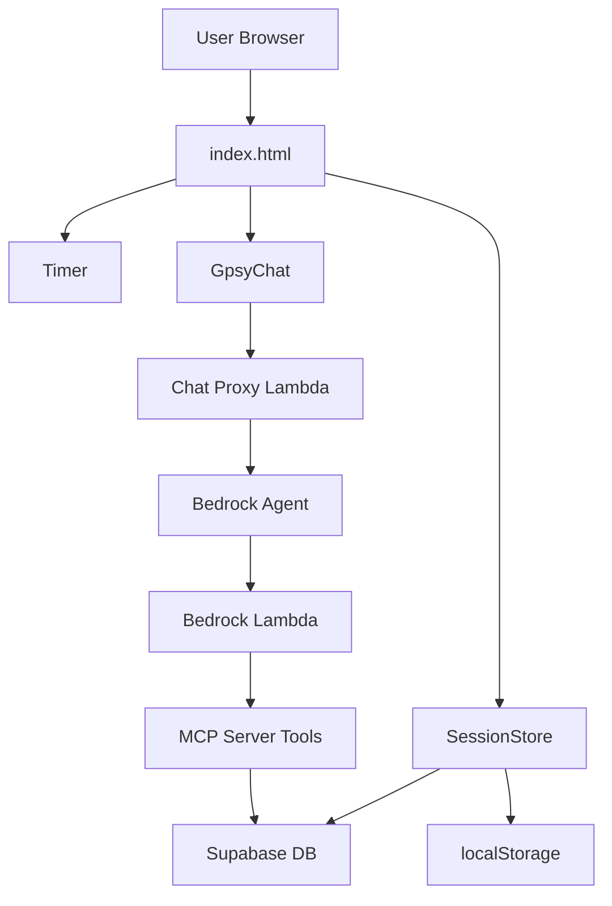
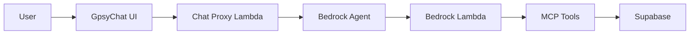

# Architecture & Technical Documentation

## System Architecture



## Modular Architecture

### File Structure
- `index.html`: Main HTML with initialization and event handlers
- `modules/session-store.js`: SessionStore class
- `modules/timer.js`: Timer class
- `modules/gpsy-chat.js`: GpsyChat class
- `modules/settings-store.js`: SettingsStore class
- `modules/readings-manager.js`: ReadingsManager class
- `modules/analytics-notifier.js`: AnalyticsNotifier class
- `modules/utils.js`: Utils class (shared utilities)

### Core Classes

#### Auth (`modules/auth.js`)
- Google OAuth via Supabase Auth
- Role-based access control (admin/user)
- Single source of truth for userId and userName
- `checkAuth()` restores session on page load, queries user_profiles for role
- `updateUI()` controls own elements only; delegates session control visibility to `window.session.updateUI()`
- `signOut()` clears all auth state and calls `window.session.startOver()`

#### SessionStore (`modules/session-store.js`)
- Manages session state; reads userId/userName from `window.auth` (not stored internally)
- Reads/writes individual readings to normalized `blacksheep_reading_tracker_readings` table
- `save()` updates session metadata only (no JSONB writes)
- `loadExistingSession()` fetches readings from normalized table
- Handles database sync with debouncing
- Computed properties: `canCreateSession`, `hasValidSession`, `sessionPhase`
- Auto-save on every state change

#### Timer (`modules/timer.js`)
- Canvas-based circular countdown (300x300px)
- Web Audio API for alarms (1000Hz square wave)
- Screen Wake Lock API + silent audio fallback
- requestAnimationFrame for smooth rendering
- Notification system with service worker integration

#### GpsyChat (`modules/gpsy-chat.js`)
- SMS-style chat interface
- HTML content rendering for tables/lists
- Animated logo avatars
- Suggestion buttons with data-prompt attributes
- User context injection for queries

#### SettingsStore (`modules/settings-store.js`)
- App preferences management
- Payment method customization
- Dark mode toggle
- Notification settings
- Settings drawer UI management

#### ReadingsManager (`modules/readings-manager.js`)
- Reading CRUD operations
- Payment/source sheet management
- Reading list UI updates

#### AnalyticsNotifier (`modules/analytics-notifier.js`)
- Daily summary notifications
- Weekend goal tracking
- Best day alerts
- Tip trend analysis
- Peak time detection

#### Utils (`modules/utils.js`)
- Date normalization (YYYY-MM-DD → MM/DD/YYYY)
- Development mode detection
- Haptic feedback (vibrate)
- Toast/snackbar notifications
- Sheet show/hide helpers

## Data Structure

### Reading Object (in-memory + normalized DB table)
```javascript
{
  id: "uuid",                              // Set after DB insert; null for unsaved
  timestamp: "2025-01-15T14:30:00.000Z",  // ISO datetime
  tip: 10,                                 // Numeric
  price: 40,                               // Null uses session price
  payment: "cash",                         // cash|cc|venmo|paypal|cashapp|custom
  source: "referral"                       // referral|renu|pog|repeat|custom
}
```

### Session State
```javascript
{
  sessionId: "uuid",
  location: "Denver Fall 25",
  sessionDate: "2025-01-15",  // YYYY-MM-DD
  price: 40,
  readings: [],
  _loading: false  // Prevents saves during restoration
  // userId and userName come from window.auth, not stored here
}
```

## Database Schema

### Authentication
- **Provider**: Supabase Auth with Google OAuth
- **Client ID**: 622943293890-1iuusaetdtucb1t76vj88802j01j6fb4.apps.googleusercontent.com
- **Redirect URLs**: localhost:8080, tracker.blacksheep-gypsies.com
- **Role-Based Access**: Admin users can view all data, regular users see only their own

### Supabase Tables

#### `blacksheep_reading_tracker_sessions`
- `id` (uuid, PK)
- `session_date` (date)
- `location` (text)
- `reading_price` (numeric)
- `readings` (jsonb) - legacy column, no longer written to
- `user_name` (text, NOT NULL) - Snapshot at session creation
- `user_id` (uuid) - References auth.users
- `created_at` (timestamptz)
- `updated_at` (timestamptz)

#### `blacksheep_reading_tracker_readings` (Normalized)
- `id` (uuid, PK)
- `session_id` (uuid, FK to sessions)
- `timestamp` (timestamptz, NOT NULL)
- `tip` (numeric, NOT NULL, default 0)
- `price` (numeric) - NULL uses session price
- `payment` (text) - cash|cc|venmo|paypal|cashapp|custom
- `source` (text) - referral|renu|pog|repeat|custom
- `created_at` (timestamptz)
- **Indexes**: session_id, timestamp, LOWER(payment), LOWER(source)

#### `blacksheep_reading_tracker_user_profiles`
- `user_id` (uuid, PK, FK to auth.users)
- `role` (text, default 'user') - 'admin' or 'user'
- `created_at` (timestamptz)

### Database Views

#### `session_summaries`
JOINs sessions + readings, pre-aggregates per session:
- `readings_count`, `base_total`, `tips_total`, `total_earnings`, `avg_tip`, `avg_price`
- `first_reading_time`, `last_reading_time`
- Used by `list_sessions_v2`

#### `readings_with_context`
JOINs readings + sessions, enriches each reading with:
- `location`, `user_name`, `user_id`, `session_date`
- `effective_price` (COALESCE reading price / session default price)
- `total_earnings` (effective_price + tip)
- `time_of_day_et` (morning/afternoon/evening via ET timezone)
- `hour_local_et`, `day_of_week_num`, `day_of_week_name`
- Used by `list_readings_v2`

### Database Functions

#### `get_session_with_readings(session_uuid)`
- Returns complete session + all its readings in one RPC call
- Used by `get_session_details_v2`

#### `get_user_summary(p_user_name, p_start_date, p_end_date)`
- Returns aggregate stats across all sessions for a user
- Optional date range filtering
- Used by `get_user_summary_v2`

**Connection**:
- URL: `https://uuindvqgdblkjzvjsyrz.supabase.co`
- Anon Key: (see index.html)
- RLS: Enabled with user_id filtering (after migration)

## MCP Server (Dual Lambda Architecture)

### Lambda Functions

**MCP Lambda**:
- Name: `blacksheep_tarot-tracker-mcp-server`
- Handler: `mcp_lambda.handler` (streaming)
- URL: https://fjmqe5vx4n6r6tklpsiyzey6ea0zuzgo.lambda-url.us-east-2.on.aws/

**Bedrock Lambda**:
- Name: `blacksheep_tarot-tracker-bedrock`
- Handler: `bedrock_lambda.handler` (direct response)
- ARN: arn:aws:lambda:us-east-2:944012085152:function:blacksheep_tarot-tracker-bedrock

### Available Tools

**V2 (normalized table-based, active):**
1. **list_sessions_v2**: Queries `session_summaries` view — faster, pre-aggregated
2. **list_readings_v2**: Queries `readings_with_context` view — full filter support
3. **get_session_details_v2**: Calls `get_session_with_readings()` RPC
4. **get_user_summary_v2**: Calls `get_user_summary()` RPC

**Legacy (JSONB-based, still in server.js but not used by Bedrock Agent):**
5. **list_sessions**, **list_readings**, **search_locations**, **aggregate_readings**

### Bedrock Agent Response Format

**SUCCESS** (no responseState):
```javascript
{
  messageVersion: "1.0",
  response: {
    actionGroup: "TarotDataTools",
    function: toolName,
    functionResponse: {
      responseBody: {
        "TEXT": { body: "JSON data" }
      }
    }
  }
}
```

**REPROMPT** (missing params):
```javascript
{
  functionResponse: {
    responseState: "REPROMPT",
    responseBody: {
      "TEXT": { body: "Need more info..." }
    }
  }
}
```

**FAILURE** (errors):
```javascript
{
  functionResponse: {
    responseState: "FAILURE",
    responseBody: {
      "TEXT": { body: "Error message" }
    }
  }
}
```

**FORBIDDEN**: `responseState: "SUCCESS"` - Bedrock rejects this

## Gpsy Chat Integration

### Architecture


### Chat Proxy Lambda
- Function: `blacksheep_tarot-tracker-bedrock-chat-proxy`
- URL: https://57h2jhw5tcjn35yzuitv4zjmfu0snuom.lambda-url.us-east-2.on.aws/
- CloudWatch Logs: https://us-east-2.console.aws.amazon.com/cloudwatch/home?region=us-east-2#logsV2:log-groups/log-group/$252Faws$252Flambda$252Fblacksheep_tarot-tracker-bedrock-chat-proxy
- User context injection: Prepends `[Context: user_id=..., user_name=..., today=..., timezone=..., loaded_session=...]` to every message - guaranteed on every tool invocation
- Timeout: 120 seconds
- Structured JSON logging (REQUEST, SUCCESS, ERROR)
- SSE format (ready for when Bedrock supports real streaming)
- Note: Bedrock currently buffers entire response despite SSE setup

### Bedrock Agent
- Agent ID: 0LC3MUMHNN
- Alias: 3T7P4GYJYK (version 42, "live")
- Model: Claude Haiku 4.5 (US inference profile: `us.anthropic.claude-haiku-4-5-20251001-v1:0`)
- Region: us-east-2
- Execution Role: `AmazonBedrockExecutionRoleForAgents_KWCJTGJ4UR`
- Action Group: TarotDataTools (v2 tools - list_sessions_v2, list_readings_v2, get_session_details_v2, get_user_summary_v2)

**CRITICAL - System Prompt Deployment:**
The file `mcp-server/bedrock-agent-system-prompt.txt` is NOT automatically deployed. It must be manually copy/pasted into the Bedrock Agent configuration in the AWS Console:
1. Go to AWS Bedrock Console → Agents
2. Find the tarot tracker agent (ID: 0LC3MUMHNN)
3. Edit the agent instructions
4. Copy/paste the entire contents of `bedrock-agent-system-prompt.txt`
5. Save the agent configuration

Changes to this file do NOT require Lambda redeployment - only manual update in the console.

**Model Configuration Notes (June 2026 migration from Haiku 3.5 → 4.5):**
- Haiku 4.5 requires an inference profile — bare model ID invocation is not supported
- Must select "US inference" (not "Global inference") in agent model config
- Global inference passes bare model ID which causes 403; US inference uses the proper profile ARN
- First invocation auto-subscribes via AWS Marketplace (requires `aws-marketplace:Subscribe` permission on invoking IAM user)
- The Marketplace subscription is token-based billing, not an additional flat fee
- Agent execution role IAM policies must include inference profile ARNs (`arn:aws:bedrock:*:ACCOUNT:inference-profile/*`)

## Deployment

### AWS Amplify
- App: `reading-tracker`
- App ID: `d2otujcpa37fuv`
- Live: https://tracker.blacksheep-gypsies.com
- Amplify: https://staging.d2otujcpa37fuv.amplifyapp.com

### DNS (Squarespace)
```
Host: tracker
Points to: dol1ob2gp2gbk.cloudfront.net
Type: CNAME
```

### SSL
- Amplify Managed Certificate
- Auto-renewal enabled
- Automatic HTTPS redirect

### Deployment Process
1. Zip project files (exclude `.amazonq/`, `.git/`)
2. Upload to Amplify Console
3. Auto-detected as static site
4. CDN distribution automatic

## Lambda Deployment

**All three Lambdas** (always deploy together):
```bash
aws lambda update-function-code --function-name blacksheep_tarot-tracker-bedrock --zip-file fileb://lambda.zip --region us-east-2
aws lambda update-function-code --function-name blacksheep_tarot-tracker-mcp-server --zip-file fileb://lambda.zip --region us-east-2
aws lambda update-function-code --function-name blacksheep_tarot-tracker-bedrock-chat-proxy --zip-file fileb://lambda.zip --region us-east-2
```

## Testing

### Local MCP Server
```bash
cd mcp-server
npm start  # Runs test-lambda.js
```

### Lambda Invoke
```bash
aws lambda invoke \
  --function-name blacksheep_tarot-tracker-mcp-server \
  --payload '{"method":"tools/list"}' \
  --region us-east-2 \
  temp.json
```

### HTTP REST API
```bash
curl -X POST \
  https://fjmqe5vx4n6r6tklpsiyzey6ea0zuzgo.lambda-url.us-east-2.on.aws/ \
  -H "Content-Type: application/json" \
  -d '{"jsonrpc":"2.0","id":1,"method":"tools/list"}'
```

## Critical Implementation Notes

### Timezone Handling
- Use raw YYYY-MM-DD strings for display
- Avoid Date object conversion (causes UTC shifts)
- Normalize: YYYY-MM-DD → MM/DD/YYYY before Date()
- YYYY-MM-DD creates UTC dates, MM/DD/YYYY creates local

### Session Loading
- `_loading` flag prevents saves during restoration
- Price fallback: null reading price uses session price
- Proper validation prevents empty date strings (400 errors)

### Canvas Timer
- Uses requestAnimationFrame for smooth animation
- Dynamic color switching for dark mode
- imageSmoothingEnabled = false for crisp rendering
- Flex container wrapper for perfect centering

### Suggestion Buttons
- Attach onclick after DOM insertion
- Short display text (2-5 words)
- Full query in data-prompt attribute
- Purple borders (#7c3aed light, #a78bfa dark)

### HTML Formatting
- Use `<ul><li>` with classes, never bullet characters (•)
- All currency: `<span class="bedrock-currency">$X</span>`
- Tables: `<table class="bedrock-table">` structure
- Wrap responses: `<div class="bedrock-response">`

## Service Worker
- Strategy: Network-first caching
- Cache version: v6
- Excludes: Supabase API calls
- Update notification with "Update Now" button

## Z-Index Hierarchy
- Snackbars: 3000
- Gpsy Drawer: 3000
- Sheets: 2001
- Drawers: 2000
- Overlays: 1999

## Browser Compatibility
- ES6 features (classes, arrow functions, destructuring)
- CSS Flexbox
- HTML5 input types
- Touch events
- Web Audio API
- Vibration API
- Fetch API
- localStorage
- Service Workers
- Screen Wake Lock API (where available)
