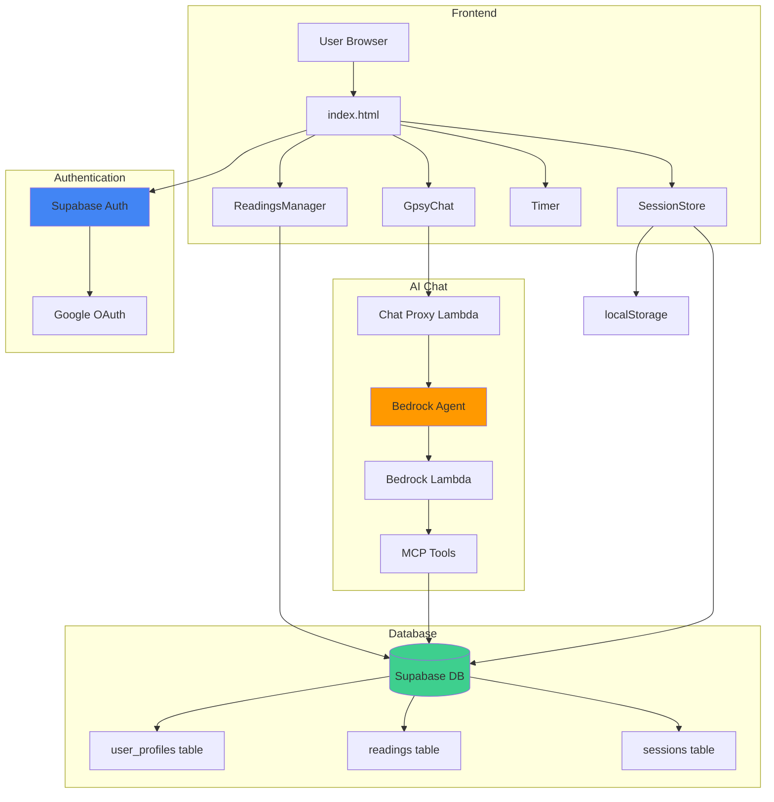
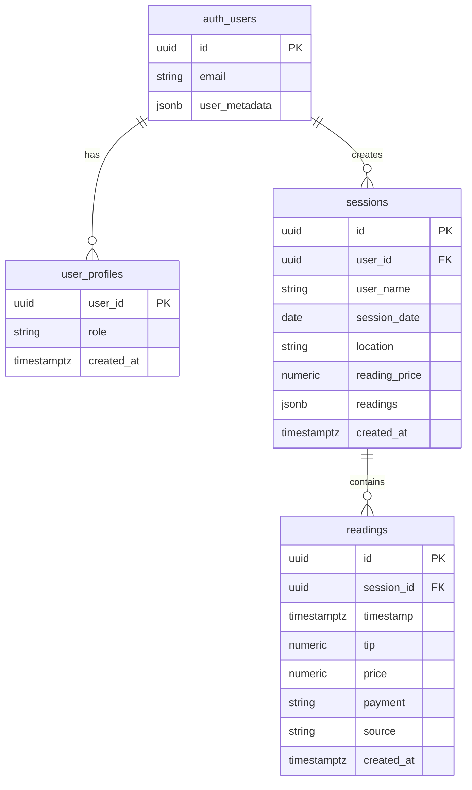
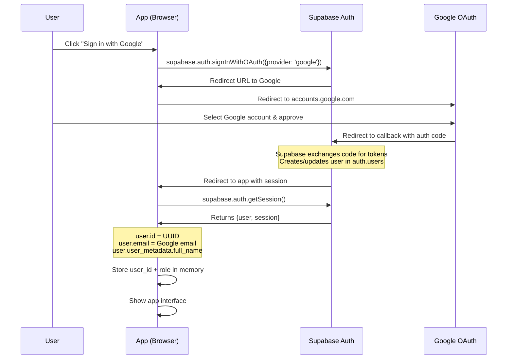

# Tarot Reading Tracker

Mobile-optimized single page app for tracking tarot readings and tips. Built with pure HTML/CSS/JS and Supabase cloud database.

## Version: v4.3.2

## Architecture Overview



## Database Schema



## Google OAuth Flow



**Key Points:**
1. **User clicks sign-in** → App calls Supabase SDK
2. **Supabase redirects** → User goes to Google's login page
3. **User approves** → Google sends auth code to Supabase callback URL
4. **Supabase handles exchange** → Converts code to access/refresh tokens
5. **Supabase creates user** → Stores in `auth.users` table (managed by Supabase)
6. **Redirect back to app** → With session cookie/token
7. **App gets session** → Extracts `user_id`, `email`, `full_name`
8. **App queries role** → Looks up `user_profiles` table for admin/user role
9. **App loads data** → Filters by `user_id` (or shows all if admin)

## Features
- **Authentication**: Google OAuth sign-in with role-based access control
- Track readings with timestamps, tips, payment methods, sources
- Real-time totals calculation
- Multi-user support with data separation by user_id
- Session management with cloud sync
- Countdown timer with audio alarms
- AI chat assistant (Gpsy) for data queries
- Report generation with date ranges
- PWA installable as standalone app
- **Admin Mode**: View and analyze data for all users

## Quick Start
1. Sign in with Google account
2. Enter event location/date
3. Click "Create Session" to start tracking
4. Click "+ Add Reading" for each reading
5. Enter tips and select payment methods
6. View real-time totals
7. Use timer for reading sessions
8. Generate reports as needed
9. **Admin users**: Switch between users to view their data

## Live App
**URL**: https://tracker.blacksheep-gypsies.com

## Local Development
```bash
npm start  # Runs on port 8080
# Access at http://192.168.5.62:8080
```

## MCP Server Setup (for Kiro/AI assistants)

This project uses MCP servers for AI-assisted development. The workspace config (`.kiro/settings/mcp.json`) is committed and provides:
- **tarot-tracker** — Project's own data access Lambda (public URL, no auth needed)
- **chrome-devtools** — Browser debugging (disabled by default)

The following servers must be configured at the **user level** (`~/.kiro/settings/mcp.json`) since they require tokens:
- **Supabase** — Direct DB access (requires bearer token from Supabase dashboard)
- **fetch** — Web content fetching (`uvx mcp-server-fetch`)
- **aws knowledge** — AWS documentation search (public URL)
- **aws** — AWS API access (requires AWS profile, disabled by default)

To set up on a new machine:
1. Install [uv](https://docs.astral.sh/uv/getting-started/installation/) for `uvx` command
2. Open Kiro command palette → "MCP" → configure user-level servers
3. Get Supabase MCP token from: Supabase Dashboard → Project Settings → MCP
4. Workspace servers will work automatically after clone

## Tech Stack
- Pure HTML/CSS/JavaScript (no frameworks)
- Supabase PostgreSQL database with normalized schema
- Supabase Auth with Google OAuth
- localStorage backup for offline
- Service Worker for PWA features
- AWS Amplify hosting
- AWS Lambda + Bedrock for AI chat

## File Structure
- `index.html`: Main application
- `manifest.json`: PWA manifest
- `serviceWorker.js`: Cache strategy
- `mcp-server/`: Data access API
- See `ARCHITECTURE.md` for technical details

## Recent Changes (v4.3.2 - Session UX Redesign)
- Replaced collapsible Event Settings panel with slim session bar + hamburger menu + bottom sheet
- Added session types (event/private) with type-driven source filtering
- Session bar: read-only display with 📍/👤 prefixes, price, date, edit pencil
- Hamburger menu: New Event, New Private Reading, Load Session, End Session
- Session sheet: type-driven fields, validation, price presets for private
- Load Session: search input, type filter toggles, type badges
- Unified sources with scope (event/private/all) in SettingsStore
- Legacy migration converts old flat string arrays to scoped objects
- App modes: readings section hidden when no active session
- Moved Switch User to profile menu (admin only)
- 223 tests passing across 8 suites

## Previous Changes (v4.0.1)
- Fixed Gpsy AI chat - was broken due to multiple bugs in mcp-server Lambda chain
- Root cause: `bedrock.js` (actual Lambda entrypoint) was never updated - all fixes were going to `bedrock-handler.js` which was never in the call chain
- Fixed `responseState: 'SUCCESS'` - not a valid Bedrock value, caused deserialization errors on every response (omitting it is correct for success)
- Fixed `body` variable scoped inside `try` block - caused `ReferenceError` in proxy catch handler
- Removed REPROMPT on missing `user_name` - agent passes `user_id` not `user_name`, killing every 2nd+ tool call
- Renamed Lambda files to normalized convention: `mcp_lambda.js`, `bedrock_lambda.js`, `proxy_lambda.js`
- Updated all three Lambda handler configs in AWS to match renamed files
- Added full decision-point logging to all three Lambdas and server.js v2 methods
- Consolidated and cleaned up mcp-server: removed 10 extraneous files, renamed 6 test files
- Added e2e test (`test-e2e.mjs`) that simulates full FE → Proxy → Agent → Lambda chain including warm-instance multi-call scenario

## Recent Changes (v4.0.0)
- Bumped to v4.0.0 - major version for Google Auth + normalized DB + v2 tools
- Updated Bedrock Agent action group to v2 tools only (list_sessions_v2, list_readings_v2, get_session_details_v2, get_user_summary_v2)
- Rewrote Bedrock Agent system prompt in XML format for better Claude comprehension
- Fixed gpsy-chat.js window.session.user references to use window.auth.isAuthenticated and window.session.userName
- Fixed showLoadSession to query session_summaries view instead of raw sessions table
- Removed orphaned JavaScript snippet outside closing HTML tag
- Migrated 80 new Amanda readings to normalized table (Cincinnati Spring 26, Denver Spring 26, San Marcos Spring 26, Seraph, Wolf & Honey)
- Backfilled user_id on all 44 Amanda sessions

## Previous Changes (v3.99.9)
- Added profile dropdown menu with Sign Out option (replaces direct logout button)
- Profile button now displays Google profile picture if available
- Added RLS policies to user_profiles table for secure access
- Fixed infinite recursion in RLS policy (simplified to allow authenticated reads)
- Admin users see user switcher button, regular users do not
- Profile menu closes on outside click
- Auth module controls profile button visibility and content

## Previous Changes (v3.99.8)
- Refactored SessionStore to remove user data storage
- Auth module is now single source of truth for userId and userName
- SessionStore reads from window.auth via getters (userId, userName)
- Removed _userId and _userName properties from SessionStore
- Deprecated old user selection methods (showUserSelection, selectUser, addNewUser, loadUsers)
- All DB operations and localStorage keys use userId from Auth
- All 227 tests passing

## Previous Changes (v3.99.7)
- Implemented Google OAuth authentication with Supabase Auth
- Created Auth module (modules/auth.js) with role-based access control
- Added user profile button and login prompt UI
- Session controls hidden when not authenticated
- Auth.checkAuth() restores last session after successful login
- Created user_profiles table for admin/user roles
- Added comprehensive Auth unit and integration tests

## Previous Changes (v3.99.6)
- Added HTML validation to ChatGPSY responses to prevent DOM corruption
- Validates HTML structure using DOMParser before rendering
- Counts open/close tags to detect incomplete HTML (tables, lists, divs)
- Shows error message instead of rendering malformed HTML
- Prevents catastrophic failure where one bad response breaks entire chat
- Strengthened Bedrock Agent prompt with explicit list formatting rules

## Previous Changes (v3.99.5)
- Centralized DOM synchronization in updateUI() as single source of truth
- Removed direct DOM updates from setters (user, location, sessionDate, price)
- Setters now only update internal state and call updateUI()
- Eliminates duplication and prevents potential circular update issues
- All 148 tests pass

## Previous Changes (v3.99.4)
- Refactored SessionStore to use setters consistently for all state changes
- Split save() into save() and saveToLocalStorage() to avoid redundant DB writes
- Fixed localStorage not updating when loading existing sessions
- Improved user/startOver methods to use setters with _loading flag
- Added XSS sanitization with Utils.sanitize() for user-generated content
- Added offline indicator badge in header with network status monitoring
- Fixed duplicate session check to happen before insert attempt
- Added double confirmation to startNewSession()

## Previous Changes (v3.99.3)
- Consolidated button CSS into base classes (btn, btn-primary, btn-secondary, btn-danger, btn-ghost)
- Added size modifiers (btn-small, btn-large, btn-xlarge)
- Reduced CSS by ~150 lines through consolidation
- All buttons now use consistent styling patterns

## Previous Changes (v3.99.2)
- Added IDs to all unique buttons and containers following {type}-{area}-{purpose} convention
- IDs are additive (classes remain unchanged) for future refactoring
- No functional changes, all tests pass

## Previous Changes (v3.99.1)
- Fixed bug where Add Reading and Delete Reading buttons disappeared after creating new session
- Added comprehensive DOM tests to verify UI state across all session phases

## Previous Changes (v3.99.0)
- Removed ~100 lines of duplicate utility functions from index.html
- All utility functions now sourced from Utils module
- Integrated AnalyticsNotifier module for analytics notifications
- Reduced index.html from 1153 to 1053 lines (9% reduction)

## Documentation
- `docs/ARCHITECTURE.md`: Technical architecture and deployment
- `docs/CHANGELOG.md`: Version history
- `.amazonq/rules/`: Development guidelines

## Browser Support
Modern mobile browsers with ES6, Flexbox, Web Audio API, Service Workers
